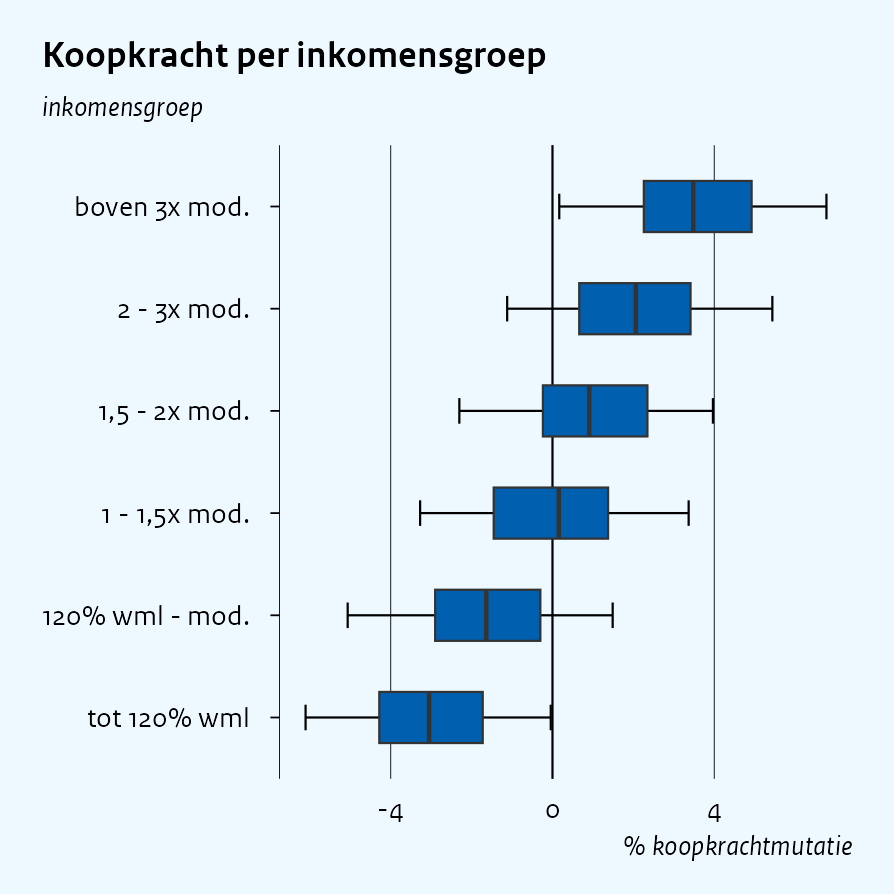
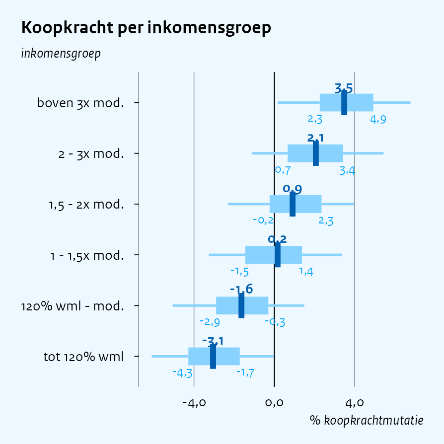
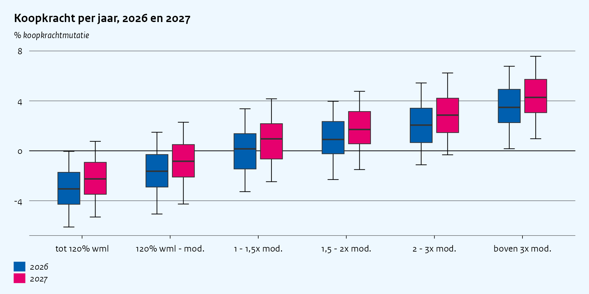
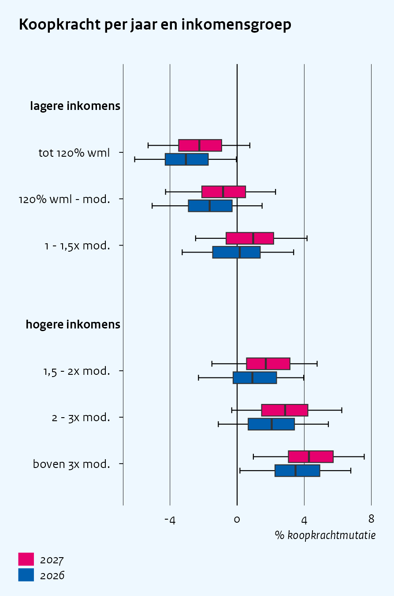
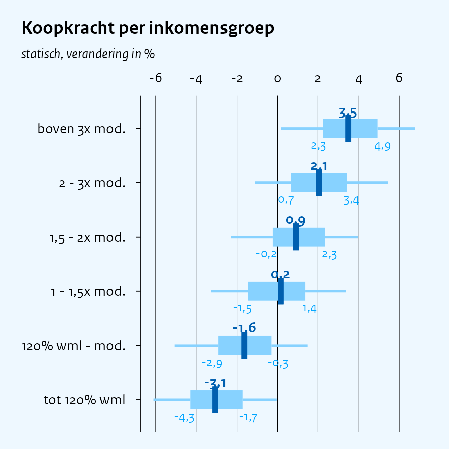

Box plots
================

``` r
library(ggcpb)
library(ggplot2)
library(dplyr)
library(tidyr)
set.seed(42)
```

`cpb_box()` draws the CPB distributional figure from **precomputed
quantile columns** (p5/p25/p50/p75/p95; both layers use
`stat = "identity"`, so aggregate your microdata first). The default
style is shown in `vignette("chart-types")`; this vignette covers the
box constructions and combinations.

One data set used throughout – purchasing power per standard income
group:

``` r
groepen <- c("tot 120% wml", "120% wml - mod.", "1 - 1,5x mod.",
             "1,5 - 2x mod.", "2 - 3x mod.", "boven 3x mod.")
raw <- tibble(
  groep      = factor(rep(groepen, each = 400), levels = groepen),
  koopkracht = rnorm(2400, mean = rep(c(-3, -1.5, 0, 1, 2, 3.5), each = 400), sd = 2)
)
kk <- raw |>
  summarise(
    p5  = quantile(koopkracht, 0.05),
    p25 = quantile(koopkracht, 0.25),
    p50 = quantile(koopkracht, 0.50),
    p75 = quantile(koopkracht, 0.75),
    p95 = quantile(koopkracht, 0.95),
    .by = groep
  )
```

# The three box styles

`box_style` selects the construction. `"ggcpb"` (the default, and the
only argument-free call) is the style of the published CPB
distributional figures: capped errorbar whiskers plus an outlined box
with a median line.

``` r
cpb_box(kk, x = groep,
  p5 = p5, p25 = p25, p50 = p50, p75 = p75, p95 = p95,
  orientation = "horizontal",
  title    = "Koopkracht per inkomensgroep",
  subtitle = "inkomensgroep",
  ylab     = "% koopkrachtmutatie")
```



`"james"` is the legacy plotter’s box: borderless, plain capless
whiskers, a black median line extending past the box, and the median
value printed above it.

``` r
cpb_box(kk, x = groep,
  p5 = p5, p25 = p25, p50 = p50, p75 = p75, p95 = p95,
  box_style   = "james",
  orientation = "horizontal",
  title    = "Koopkracht per inkomensgroep",
  subtitle = "inkomensgroep",
  ylab     = "% koopkrachtmutatie")
```


`"modern"` is the designer variant: light-blue boxes and whiskers, a
thick dark-blue median with the value in bold above it, and the quartile
values printed below the box ends.

``` r
cpb_box(kk, x = groep,
  p5 = p5, p25 = p25, p50 = p50, p75 = p75, p95 = p95,
  box_style   = "modern",
  orientation = "horizontal",
  width       = 0.35,
  title    = "Koopkracht per inkomensgroep",
  subtitle = "inkomensgroep",
  ylab     = "% koopkrachtmutatie") +
  scale_y_continuous(labels = label_number_nl(accuracy = 0.1))
```



`"james"` and `"modern"` print value labels by default
(`box_labels = FALSE` turns them off, `label_accuracy` controls their
rounding) and draw single-colour boxes: `fill_colour` sets the colour,
and may be a *vector* with one colour per row. A `fill` mapping is only
supported by `"ggcpb"`.

# A fill per year

Map `fill` (with the `"ggcpb"` style) and pass a `position_dodge()` for
grouped boxes – for example one pair of years per income group:

``` r
kk2 <- expand_grid(kk, jaar = factor(c(2026, 2027))) |>
  mutate(across(p5:p95, \(q) q + (jaar == "2027") * 0.8))

cpb_box(kk2, x = groep,
  p5 = p5, p25 = p25, p50 = p50, p75 = p75, p95 = p95,
  fill     = jaar,
  position = position_dodge(width = 0.6),
  index    = c(6, 2),
  title    = "Koopkracht per jaar, 2026 en 2027",
  ylab     = "% koopkrachtmutatie") +
  scale_y_continuous(labels = label_number_nl())
```



# Grouped, with a fill per year

The `fill` mapping combines with the vertically grouped layout of
`vignette("layout")`: bold group headings on the category axis, and
within every category a dodged pair of years. `reverse_legend = TRUE`
puts the first year at the bottom of the legend, matching the dodge
order under `coord_flip()`:

``` r
kk3 <- kk2 |>
  mutate(grp = factor(
    ifelse(groep %in% groepen[1:3], "lagere inkomens", "hogere inkomens"),
    levels = c("lagere inkomens", "hogere inkomens")
  ))

cpb_box(kk3, x = groep,
  p5 = p5, p25 = p25, p50 = p50, p75 = p75, p95 = p95,
  fill     = jaar,
  group    = grp,
  position = position_dodge(width = 0.6),
  orientation = "horizontal",
  index    = c(6, 2),
  reverse_legend = TRUE,
  title = "Koopkracht per jaar en inkomensgroep",
  ylab  = "% koopkrachtmutatie")
```



For the single-colour grouped layout (one box per category, one colour
per group, as in the published inkomenseffecten figures), see
`vignette("layout")`.

# Value axis on top

The flagship CPB koopkracht figure draws the value axis along the *top*
of the panel, with the income groups down the side. Pass
`value_axis = "top"` (horizontal boxes only):

``` r
cpb_box(kk, x = groep,
  p5 = p5, p25 = p25, p50 = p50, p75 = p75, p95 = p95,
  box_style    = "modern",
  orientation  = "horizontal",
  value_axis   = "top",
  value_breaks = seq(-6, 6, 2),
  width        = 0.35,
  title    = "Koopkracht per inkomensgroep",
  subtitle = "statisch, verandering in %")
```



Under the hood this sets the value scale to `position = "right"`, which
`coord_flip()` renders along the top edge. Set custom tick positions
through the wrapper’s `value_breaks` (as here) rather than adding a
second `scale_y_continuous()`, which would replace the wrapper’s scale.
