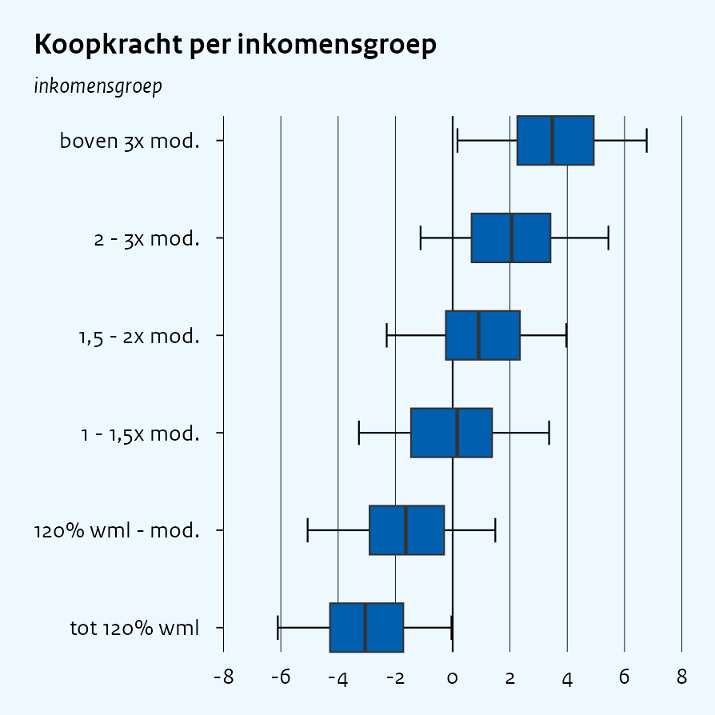
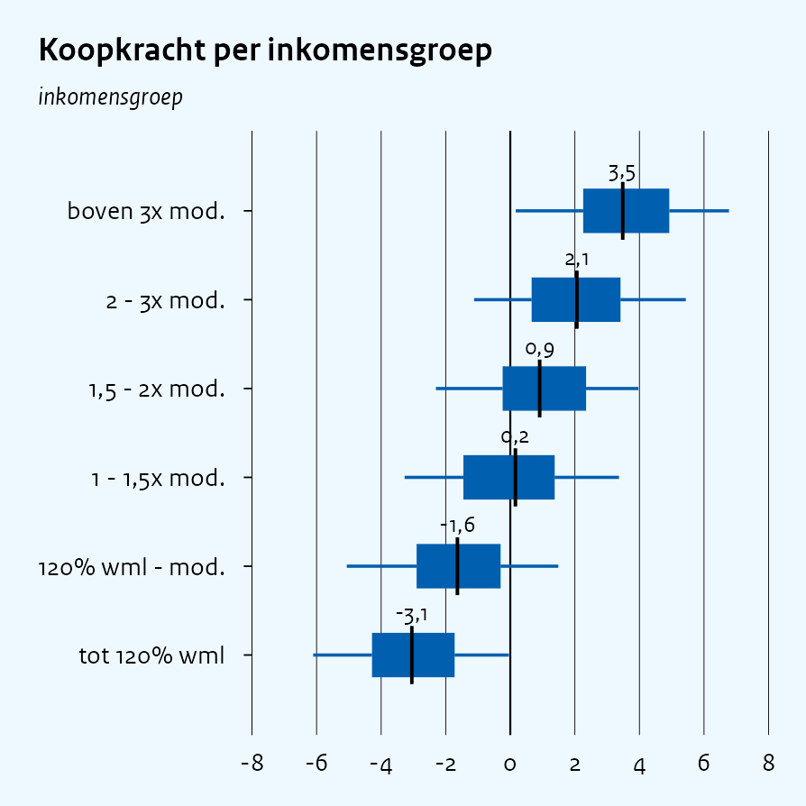
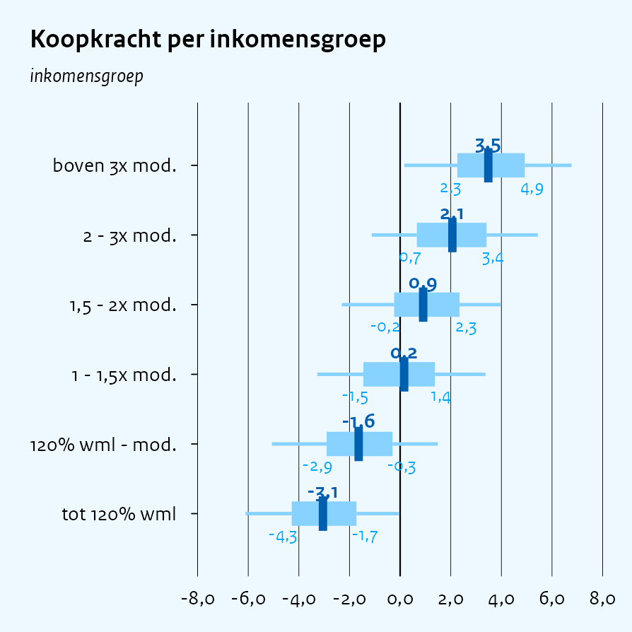
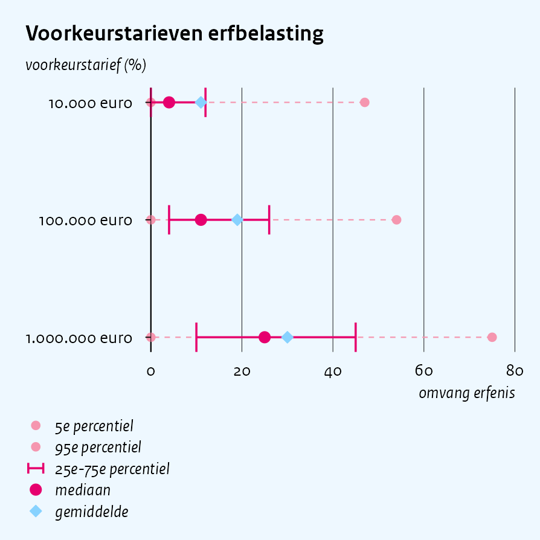
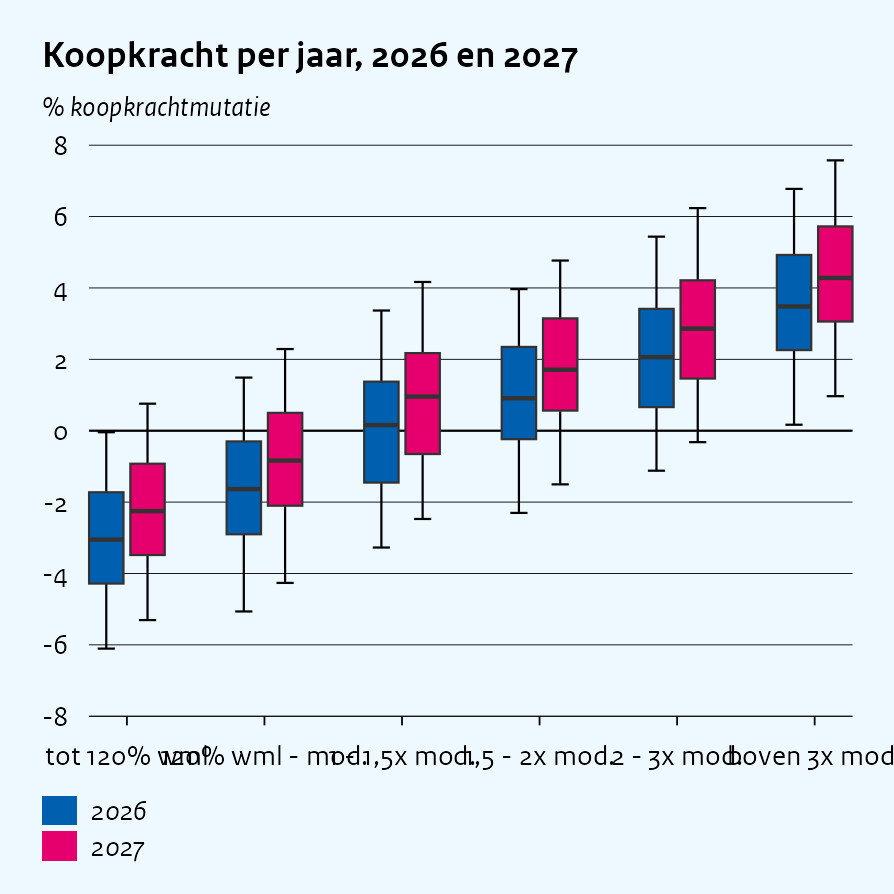
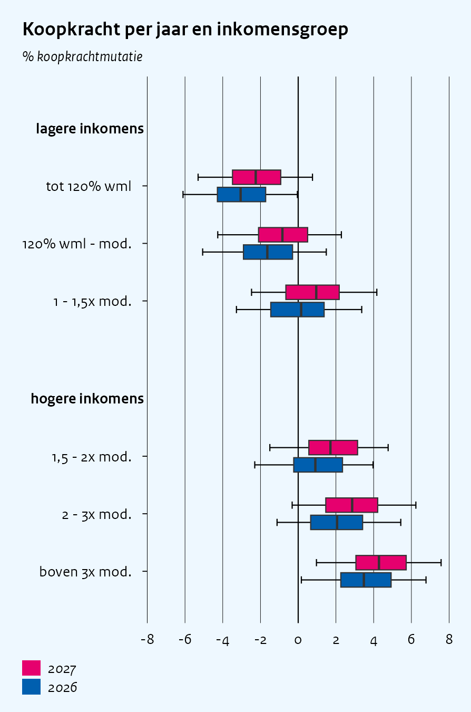
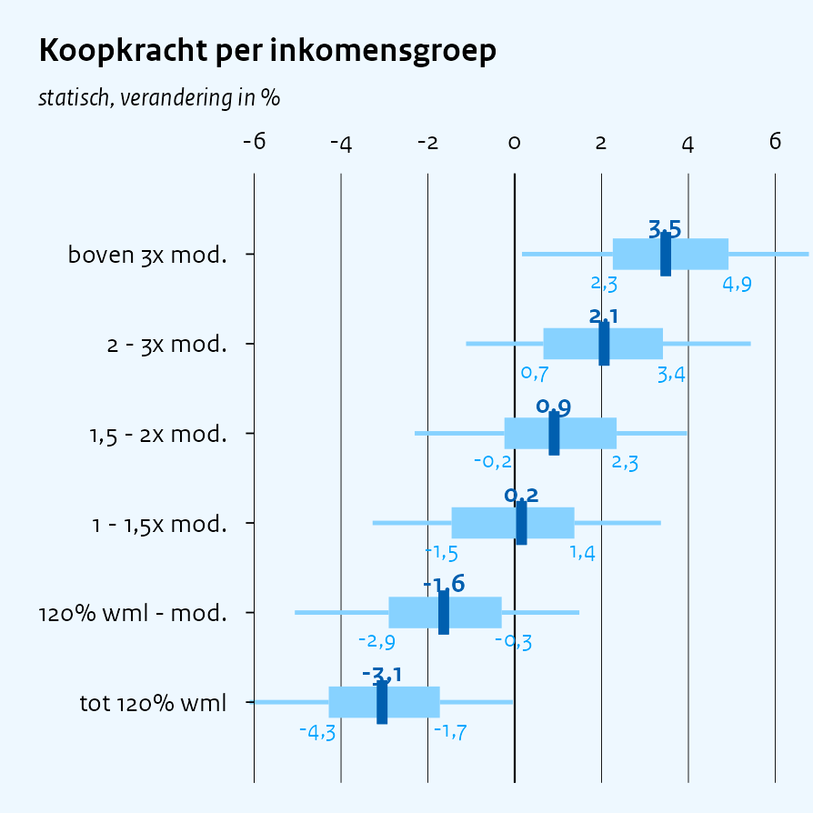
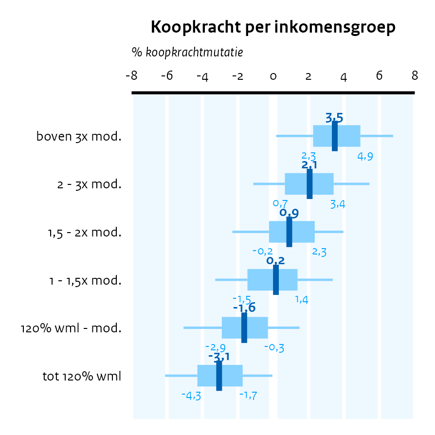
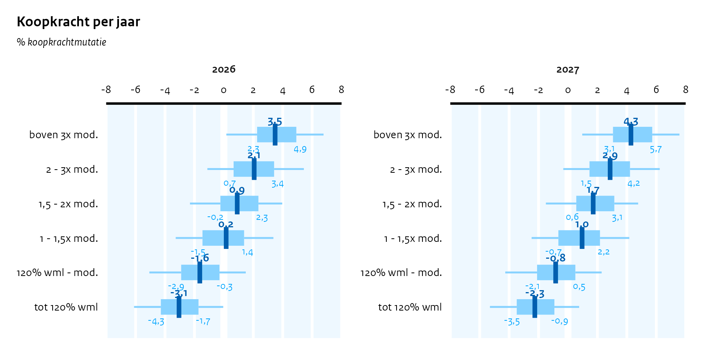
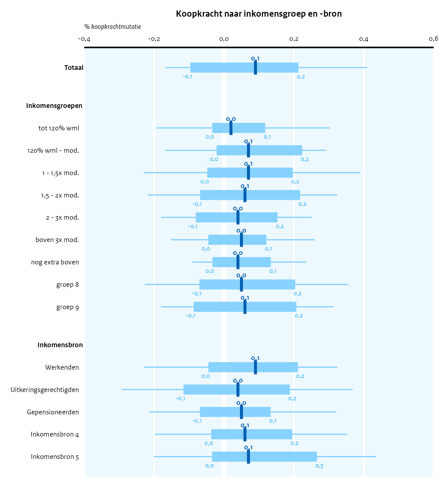

Box plots
================

``` r
library(ggcpb)
library(ggplot2)
library(dplyr)
library(tidyr)
set.seed(42)
```

`cpb_box()` draws the CPB distributional figure from **precomputed
quantile columns** (p5/p25/p50/p75/p95; both layers use
`stat = "identity"`, so aggregate your microdata first). The default
style is shown in [`vignette("chart-types")`](chart-types.md); this
vignette covers the box constructions and combinations.

One data set used throughout – purchasing power per standard income
group:

``` r
groepen <- c("tot 120% wml", "120% wml - mod.", "1 - 1,5x mod.",
             "1,5 - 2x mod.", "2 - 3x mod.", "boven 3x mod.")
raw <- tibble(
  groep      = factor(rep(groepen, each = 400), levels = groepen),
  koopkracht = rnorm(2400, mean = rep(c(-3, -1.5, 0, 1, 2, 3.5), each = 400), sd = 2)
)
kk <- raw |>
  summarise(
    p5  = quantile(koopkracht, 0.05),
    p25 = quantile(koopkracht, 0.25),
    p50 = quantile(koopkracht, 0.50),
    p75 = quantile(koopkracht, 0.75),
    p95 = quantile(koopkracht, 0.95),
    .by = groep
  )
```

# The three box styles

`box_style` selects the construction. `"ggcpb"` (the default, and the
only argument-free call) is the style of the published CPB
distributional figures: capped errorbar whiskers plus an outlined box
with a median line.

``` r
cpb_box(kk, x = groep,
  p5 = p5, p25 = p25, p50 = p50, p75 = p75, p95 = p95,
  orientation = "horizontal",
  title    = "Koopkracht per inkomensgroep",
  subtitle = "inkomensgroep",
  ylab     = "% koopkrachtmutatie")
```



`"james"` is the legacy plotter’s box: borderless, plain capless
whiskers, a black median line extending past the box, and the median
value printed above it.

``` r
cpb_box(kk, x = groep,
  p5 = p5, p25 = p25, p50 = p50, p75 = p75, p95 = p95,
  box_style   = "james",
  orientation = "horizontal",
  title    = "Koopkracht per inkomensgroep",
  subtitle = "inkomensgroep",
  ylab     = "% koopkrachtmutatie")
```



`"modern"` is the designer variant: light-blue boxes and whiskers, a
thick dark-blue median with the value in bold above it, and the quartile
values printed below the box ends.

``` r
cpb_box(kk, x = groep,
  p5 = p5, p25 = p25, p50 = p50, p75 = p75, p95 = p95,
  box_style      = "modern",
  orientation    = "horizontal",
  width          = 0.35,
  value_accuracy = 0.1,
  title    = "Koopkracht per inkomensgroep",
  subtitle = "inkomensgroep",
  ylab     = "% koopkrachtmutatie")
```



`"james"` and `"modern"` print value labels by default
(`box_labels = FALSE` turns them off, `label_accuracy` controls their
rounding) and draw single-colour boxes: `fill_colour` sets the colour,
and may be a *vector* with one colour per row. A `fill` mapping is only
supported by `"ggcpb"`.

`"dot"` is the fourth style, and the only one that draws no box at all.
It is the form used for survey distributions, where the reader needs to
tell five separate statistics apart: a dashed connector spans p5-p95
with a light dot at each end, a capped bar spans the interquartile
range, a filled dot marks the median, and the optional `mean` column
adds a diamond. Because the markers carry no shape of their own meaning,
this style names each one in a legend instead of printing values:

``` r
voorkeur <- tibble(
  erfenis = factor(c("10.000 euro", "100.000 euro", "1.000.000 euro"),
                   levels = c("1.000.000 euro", "100.000 euro", "10.000 euro")),
  p5  = c(0, 0, 0),     p25 = c(0, 4, 10),    p50 = c(4, 11, 25),
  p75 = c(12, 26, 45),  p95 = c(47, 54, 75),  gem = c(11, 19, 30)
)

cpb_box(voorkeur, x = erfenis,
  p5 = p5, p25 = p25, p50 = p50, p75 = p75, p95 = p95,
  mean        = gem,
  box_style   = "dot",
  orientation = "horizontal",
  title = "Voorkeurstarieven erfbelasting",
  xlab  = "omvang erfenis",
  ylab  = "voorkeurstarief (%)")
```



Leave `mean` out and the diamond disappears from both the chart and the
legend. `dot_labels` renames any of the five keys – pass only the ones
you want to change, e.g. `c(p50 = "median")` – which is what you need
when the figure is captioned in English.

# A fill per year

Map `fill` (with the `"ggcpb"` style) and pass a `position_dodge()` for
grouped boxes – for example one pair of years per income group:

``` r
kk2 <- expand_grid(kk, jaar = factor(c(2026, 2027))) |>
  mutate(across(p5:p95, \(q) q + (jaar == "2027") * 0.8))

cpb_box(kk2, x = groep,
  p5 = p5, p25 = p25, p50 = p50, p75 = p75, p95 = p95,
  fill     = jaar,
  position = position_dodge(width = 0.6),
  fill_index = c(6, 2),
  title    = "Koopkracht per jaar, 2026 en 2027",
  ylab     = "% koopkrachtmutatie")
```



# Grouped, with a fill per year

The `fill` mapping combines with the vertically grouped layout of
[`vignette("layout")`](layout.md): bold group headings on the category
axis, and within every category a dodged pair of years.
`reverse_legend = TRUE` puts the first year at the bottom of the legend,
matching the dodge order under `coord_flip()`:

``` r
kk3 <- kk2 |>
  mutate(grp = factor(
    ifelse(groep %in% groepen[1:3], "lagere inkomens", "hogere inkomens"),
    levels = c("lagere inkomens", "hogere inkomens")
  ))

cpb_box(kk3, x = groep,
  p5 = p5, p25 = p25, p50 = p50, p75 = p75, p95 = p95,
  fill     = jaar,
  group    = grp,
  position = position_dodge(width = 0.6),
  orientation = "horizontal",
  fill_index = c(6, 2),
  reverse_legend = TRUE,
  title = "Koopkracht per jaar en inkomensgroep",
  ylab  = "% koopkrachtmutatie")
```



For the single-colour grouped layout (one box per category, one colour
per group, as in the published inkomenseffecten figures), see
[`vignette("layout")`](layout.md).

# Value axis on top

The flagship CPB koopkracht figure draws the value axis along the *top*
of the panel, with the income groups down the side. Pass
`value_axis = "top"` (horizontal boxes only):

``` r
cpb_box(kk, x = groep,
  p5 = p5, p25 = p25, p50 = p50, p75 = p75, p95 = p95,
  box_style    = "modern",
  orientation  = "horizontal",
  value_axis   = "top",
  value_breaks = seq(-6, 6, 2),
  width        = 0.35,
  title    = "Koopkracht per inkomensgroep",
  subtitle = "statisch, verandering in %")
```



Under the hood this sets the value scale to `position = "right"`, which
`coord_flip()` renders along the top edge. Set custom tick positions
through the wrapper’s `value_breaks` (as here) rather than adding a
second `scale_y_continuous()`, which would replace the wrapper’s scale.

# The extended look

`cpb_boxplot_extended()` wraps `cpb_box()` with a fixed set of visual
choices baked in – a light blue panel, white gridlines instead of black,
a bold value axis on its own edge, and a title that adapts to whether
the figure is faceted – so a caller does not have to reach for a manual
`theme()` call to get that look. It takes the same arguments as
`cpb_box()` itself, with a handful of defaults already changed to match:
`box_style = "modern"`, `orientation = "horizontal"`,
`value_axis = "top"`, `width = 0.45`.

``` r
cpb_boxplot_extended(kk, x = groep,
  p5 = p5, p25 = p25, p50 = p50, p75 = p75, p95 = p95,
  title = "Koopkracht per inkomensgroep",
  ylab  = "% koopkrachtmutatie")
```



With `facet`, the same call splits into one panel per level – here,
`kk2` from the fill-per-year example above, one panel per year – and the
title switches from centred over the single panel above to the ordinary
full-width, left-aligned house title spanning all of them:

``` r
cpb_boxplot_extended(kk2, x = groep,
  p5 = p5, p25 = p25, p50 = p50, p75 = p75, p95 = p95,
  facet      = jaar,
  facet_ncol = 2,
  title = "Koopkracht per jaar",
  ylab  = "% koopkrachtmutatie")
```



`group` works the same way it does on `cpb_box()` itself: every category
belongs to a group, and each group gets its own bold heading row above
its categories, with the categories underneath left at the ordinary text
weight – so the two read apart from each other without needing a legend.
A taller figure with three groups, a mix of income brackets and income
sources:

``` r
groepen2 <- c("tot 120% wml", "120% wml - mod.", "1 - 1,5x mod.",
             "1,5 - 2x mod.", "2 - 3x mod.", "boven 3x mod.", "nog extra boven",
             "groep 8", "groep 9")

ink <- tibble(
  cat = factor(c("Totaal", groepen2,
                 "Werkenden", "Uitkeringsgerechtigden", "Gepensioneerden",
                 "Inkomensbron 4", "Inkomensbron 5"),
               levels = c("Totaal", groepen2,
                          "Werkenden", "Uitkeringsgerechtigden", "Gepensioneerden",
                          "Inkomensbron 4", "Inkomensbron 5")),
  grp = factor(rep(c("Totaal", "Inkomensgroepen", "Inkomensbron"), c(1, 9, 5)),
               levels = c("Totaal", "Inkomensgroepen", "Inkomensbron")),
  p50 = c(0.09, 0.02, 0.07, 0.07, 0.06, 0.04, 0.05, 0.04, 0.05, 0.06,
          0.09, 0.04, 0.05, 0.06, 0.07)
) |>
  mutate(p25 = p50 - runif(n(), 0.05, 0.2), p75 = p50 + runif(n(), 0.05, 0.2),
         p5  = p25 - runif(n(), 0.05, 0.2), p95 = p75 + runif(n(), 0.05, 0.2))

cpb_boxplot_extended(ink, x = cat, group = grp,
  p5 = p5, p25 = p25, p50 = p50, p75 = p75, p95 = p95,
  title = "Koopkracht naar inkomensgroep en -bron",
  ylab  = "% koopkrachtmutatie")
```



# Sources

The quantile data above is **simulated**; the layouts follow real CPB
figures. The `"dot"` style is modelled on a figure in [Erfbelasting in
beeld: feiten, percepties en voorkeuren van
Nederlanders](https://www.cpb.nl/publicatie/erfbelasting-beeld-feiten-percepties-en-voorkeuren-van-nederlanders),
and the rendered originals are kept in `references/plots/`.
