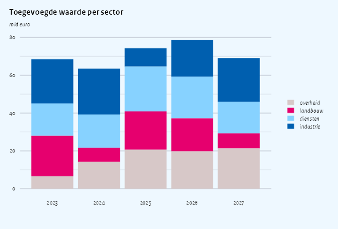

CPB chart types
================

``` r
library(ggcpb)
library(ggplot2)
set.seed(42)
```

This vignette is a cookbook: one section per CPB chart type, each with
the simulated data it needs and the wrapper call that draws it. All
wrappers return a plain `ggplot` object, so anything here can be
extended further with `+`. The figures use `style = "nplot"`, the house
look of published CPB figures; leave `style` unset for the lighter
hand-rolled ggplot look (see the last section, and `vignette("ggcpb")`
for the composable core the wrappers build on).

Two house conventions to know up front:

- **Titles and units.** `title` is the bold heading. The value-axis unit
  goes in `ylab` and is rendered as the italic caption above the panel
  (the CPB “subtitle” position), not as a rotated axis title. A titled
  figure always reserves that caption line, so figures with and without
  a unit align.
- **Zero line.** Under `style = "nplot"` a solid black zero line is
  drawn automatically on the value axis: always for columns and areas
  (which are anchored at zero), and for lines and boxplots whenever the
  data spans zero.

# Line charts

A single series needs only `x` and `y`; it is drawn in the CPB primary
blue:

``` r
bbp <- data.frame(
  jaar  = 2015:2027,
  index = 100 + cumsum(rnorm(13, mean = 1.5, sd = 1.2))
)

cpb_line(bbp, x = jaar, y = index,
  style = "nplot",
  title = "Bruto binnenlands product",
  ylab  = "index (2015 = 100)")
```

<!-- -->

Map a column to `colour` for multiple series, and pick house colours by
palette position with `index` – `c(6, 2)` is the recurring blue/magenta
pair. Growth rates span zero, so the black zero line appears by itself:

``` r
groei <- expand.grid(jaar = 2000:2024,
                     reeks = c("arbeidsproductiviteit", "tfp"))
groei$waarde <- round(rnorm(nrow(groei), mean = 1, sd = 1.6), 1)

cpb_line(groei, x = jaar, y = waarde, colour = reeks,
  style = "nplot",
  index = c(6, 2),
  title = "Productiviteitsgroei",
  ylab  = "%") +
  scale_x_continuous(
    breaks       = seq(2000, 2024, 4),
    minor_breaks = 2000:2024,
    guide        = guide_axis(minor.ticks = TRUE)
  )
```

<!-- -->

The added `scale_x_continuous()` shows the usual refinements for a year
axis: labelled breaks every few years plus small minor ticks for the
years in between.

# Column charts

`cpb_col()` covers stacked, dodged and horizontal bars. Stacked is the
default `position`:

``` r
sectoren <- c("industrie", "diensten", "landbouw", "overheid")
tw <- expand.grid(jaar = 2023:2027,
                  sector = factor(sectoren, levels = sectoren))
tw$waarde <- round(runif(nrow(tw), 5, 25), 1)

cpb_col(tw, x = jaar, y = waarde, fill = sector,
  style = "nplot",
  index = c(6, 5, 2, 4),
  title = "Toegevoegde waarde per sector",
  ylab  = "mld euro")
```

<!-- -->

By default the fill legend is reversed (`reverse_legend = TRUE`), so it
reads in the same top-to-bottom order as the stack. For dodged bars,
switch that off so the legend follows the series order:

``` r
scenario <- expand.grid(regio    = c("Noord", "Oost", "Zuid", "West"),
                        scenario = c("basispad", "beleidsvariant"))
scenario$effect <- round(runif(nrow(scenario), -2, 6), 1)

cpb_col(scenario, x = regio, y = effect, fill = scenario,
  position = "dodge",
  style = "nplot",
  index = c(6, 2),
  reverse_legend = FALSE,
  title = "Effect per regio en scenario",
  ylab  = "% mutatie")
```

<!-- -->

## Horizontal bars

`orientation = "horizontal"` flips the chart and moves the gridlines to
the value axis. Here `ylab` labels the *category* axis (still the
caption above the panel) and `xlab` labels the value axis at the bottom.
`pct_axis` formats the value axis with Dutch percentage labels,
`value_limits` fixes its range, and under `style = "nplot"` the panel
starts exactly at the zero axis:

``` r
groepen <- c("tot 120% wml", "120% wml - mod.", "1 - 1,5x mod.",
             "1,5 - 2x mod.", "2 - 3x mod.", "boven 3x mod.")
auto <- data.frame(
  # reversed levels put the first-named group at the top after the flip
  inkomensgroep = factor(groepen, levels = rev(groepen)),
  share         = c(62, 35, 26, 19, 14, 13)
)

cpb_col(auto, x = inkomensgroep, y = share,
  orientation  = "horizontal",
  style        = "nplot",
  pct_axis     = TRUE,
  value_limits = c(0, 70),
  width        = 0.6,
  title = "Aandeel huishoudens zonder auto naar inkomen",
  ylab  = "inkomensgroep",
  xlab  = "huishoudens zonder auto")
```

<!-- -->

A horizontal *dodged* bar needs one extra trick. Under `coord_flip()`
the dodge draws the *last* factor level on top within each group, so to
show (say) 2021 above 2024 you reverse the `jaar` levels, swap the
`index` to keep each year its colour, and let `reverse_legend` restore
the reading order:

``` r
pv <- expand.grid(
  inkomensgroep = factor(groepen, levels = rev(groepen)),
  jaar          = factor(c(2021, 2024), levels = c(2024, 2021))
)
pv$share <- c(10, 14, 19, 22, 26, 33,   # 2021
              19, 25, 31, 38, 47, 59)   # 2024

cpb_col(pv, x = inkomensgroep, y = share, fill = jaar,
  position     = "dodge",
  orientation  = "horizontal",
  style        = "nplot",
  index        = c(2, 6),        # level order is (2024, 2021)
  value_breaks = seq(0, 70, 10),
  value_limits = c(0, 70),
  width        = 0.85,
  title = "Zonnepanelen naar inkomen",
  ylab  = "inkomensgroepen",
  xlab  = "aandeel binnen inkomensgroep (%)")
```

<!-- -->

Note `value_breaks`: custom breaks for the value axis go through the
wrapper, not through a second `scale_y_continuous()`, which would
silently replace the wrapper’s percentage labels and zero-flush
expansion.

# Area charts

`cpb_area()` draws the recurring share-of-total-over-time figure. With
`pct_axis = TRUE` the y axis gets Dutch percentage labels:

``` r
bronnen <- c("gas", "elektriciteit", "warmte", "overig")
mix <- expand.grid(jaar = 2018:2027,
                   bron = factor(bronnen, levels = bronnen))
mix$ruw <- runif(nrow(mix), 1, 10)
mix$aandeel <- with(mix, 100 * ruw / ave(ruw, jaar, FUN = sum))

cpb_area(mix, x = jaar, y = aandeel, fill = bron,
  pct_axis = TRUE,
  style    = "nplot",
  index    = c(6, 5, 2, 4),
  title    = "Energiemix van huishoudens")
```

<!-- -->

# Quantile boxplots

`cpb_box()` draws the CPB distributional figure: a box over the p25–p75
interquartile range with the median at p50, and thin errorbar whiskers
out to p5 and p95. It expects **precomputed quantile columns** (both
layers use `stat = "identity"`), so aggregate your microdata first:

``` r
groepen5 <- c("laagste 20%", "2e 20%", "midden 20%", "4e 20%", "hoogste 20%")
raw <- data.frame(
  groep      = factor(rep(groepen5, each = 400), levels = groepen5),
  koopkracht = rnorm(2000, mean = rep(c(-3, -1.5, 0, 1.5, 3.5), each = 400), sd = 2)
)
kk <- do.call(rbind, lapply(split(raw, raw$groep), function(d) {
  q <- quantile(d$koopkracht, c(0.05, 0.25, 0.5, 0.75, 0.95))
  data.frame(groep = d$groep[1],
             p5 = q[1], p25 = q[2], p50 = q[3], p75 = q[4], p95 = q[5])
}))

cpb_box(kk, x = groep,
  p5 = p5, p25 = p25, p50 = p50, p75 = p75, p95 = p95,
  orientation = "horizontal",
  style = "nplot",
  title = "Koopkracht per inkomensgroep",
  ylab  = "% koopkrachtmutatie")
```

<!-- -->

Boxes without a `fill` mapping are drawn in the CPB primary blue. Map
`fill` and pass a `position_dodge()` for grouped boxes – for example one
pair of years per income group:

``` r
kk2 <- merge(kk, data.frame(jaar = factor(c(2026, 2027))))
shift <- ifelse(kk2$jaar == "2027", 0.8, 0)
kk2[c("p5", "p25", "p50", "p75", "p95")] <-
  kk2[c("p5", "p25", "p50", "p75", "p95")] + shift

cpb_box(kk2, x = groep,
  p5 = p5, p25 = p25, p50 = p50, p75 = p75, p95 = p95,
  fill     = jaar,
  position = position_dodge(width = 0.6),
  style    = "nplot",
  index    = c(6, 2),
  title    = "Koopkracht per jaar, 2026 en 2027",
  ylab     = "% koopkrachtmutatie") +
  scale_y_continuous(labels = label_number_nl())
```

<!-- -->

# Composing: a line over stacked columns

Because every wrapper returns a real `ggplot`, a decomposition chart –
stacked contribution columns with the total drawn as a line – is just
`cpb_col()` plus a `geom_line()` layer and a colour scale for the extra
series:

``` r
componenten <- c("kapitaal/uren", "arbeidssamenstelling", "tfp")
dec <- expand.grid(jaar = 2000:2024,
                   # reversed levels stack the first component nearest zero
                   component = factor(componenten, levels = rev(componenten)))
dec$bijdrage <- round(rnorm(nrow(dec), mean = 0.4, sd = 0.9), 1)
totaal <- aggregate(bijdrage ~ jaar, dec, sum)

cpb_col(dec, x = jaar, y = bijdrage, fill = component,
  position = "stack",
  style    = "nplot",
  index    = c(2, 5, 6),
  width    = 0.75,
  title    = "Opbouw productiviteitsgroei",
  ylab     = "%") +
  geom_line(
    data    = totaal,
    mapping = aes(x = jaar, y = bijdrage, colour = "arbeidsproductiviteit"),
    linewidth = 0.55, inherit.aes = FALSE
  ) +
  scale_colour_cpb_manual(index = 1) +
  labs(colour = NULL) +
  guides(fill   = guide_legend(reverse = TRUE, order = 1),
         colour = guide_legend(order = 2)) +
  theme(legend.box = "horizontal", legend.box.just = "top")
```

<!-- -->

# The two styles

Everything above used `style = "nplot"`. The default `style = "ggplot"`
keeps the lighter hand-rolled look – CPB-grey gridlines with minors, no
ticks or zero line, legend on the right:

``` r
cpb_col(tw, x = jaar, y = waarde, fill = sector,
  index = c(6, 5, 2, 4),
  title = "Toegevoegde waarde per sector",
  ylab  = "mld euro")
```

<!-- -->

Both presets are just defaults: every knob (`minor`, `ticks`,
`grid_colour`, `flush_legend`, `zeroline`, …) can be set per call, see
`?theme_cpb`.

# Export

`save_cpb()` writes the figure at the strict CPB page widths –
`page = "half"` (2.98 in) or `page = "full"` (5.96 in) – through the
`ragg` device, so the bundled Rijksoverheid font renders correctly:

``` r
p <- cpb_line(bbp, x = jaar, y = index,
  style = "nplot",
  title = "Bruto binnenlands product",
  ylab  = "index (2015 = 100)")

save_cpb("bbp.png", p, page = "half")
save_cpb("bbp_breed.png", p, page = "full", height = 3.2)
```

For a rendered gallery of all chart types against the published
reference figures, run `inst/examples/smoke_test_plots.R`.
