CPB chart types
================

``` r
library(ggcpb)
library(ggplot2)
library(dplyr)
library(tidyr)
set.seed(42)
```

This vignette is a cookbook: one section per CPB chart type, each with
the simulated data it needs and the wrapper call that draws it. All
wrappers return a plain `ggplot` object, so anything here can be
extended further with `+`. See `vignette("ggcpb")` for the composable
core the wrappers build on.

Two house conventions to know up front:

- **Titles and units.** `title` is the bold heading. The value-axis unit
  goes in `ylab` and is rendered as the italic caption above the panel
  (the CPB “subtitle” position), not as a rotated axis title. A titled
  figure always reserves that caption line, so figures with and without
  a unit align.
- **Zero line.** A solid black zero line is drawn automatically on the
  value axis: always for columns and areas (which are anchored at zero),
  and for lines and boxplots whenever the data spans zero.

# Line charts

A single series needs only `x` and `y`; it is drawn in the CPB primary
blue:

``` r
bbp <- tibble(
  jaar  = 2015:2027,
  index = 100 + cumsum(rnorm(13, mean = 1.5, sd = 1.2))
)

cpb_line(bbp, x = jaar, y = index,
  title = "Bruto binnenlands product",
  ylab  = "index (2015 = 100)") +
  scale_x_continuous(breaks = seq(2015, 2027, 3), minor_breaks = 2015:2027,
                     guide = guide_axis(minor.ticks = TRUE))
```

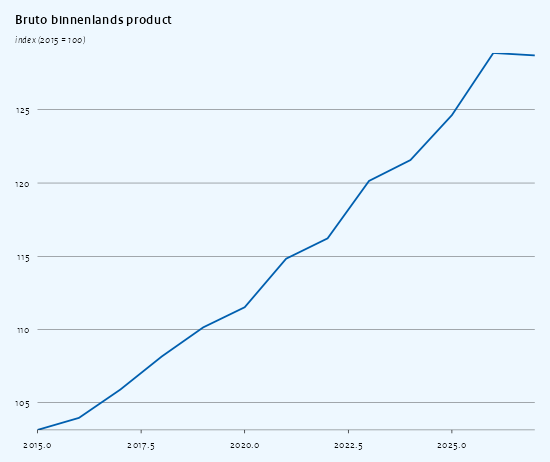

Map a column to `colour` for multiple series, and pick house colours by
palette position with `index` – `c(6, 2)` is the recurring blue/magenta
pair. Growth rates span zero, so the black zero line appears by itself:

``` r
groei <- expand_grid(reeks = c("arbeidsproductiviteit", "tfp"),
                     jaar  = 2000:2024) |>
  mutate(waarde = round(rnorm(n(), mean = 1, sd = 1.6), 1))

cpb_line(groei, x = jaar, y = waarde, colour = reeks,
  index = c(6, 2),
  title = "Productiviteitsgroei",
  ylab  = "%") +
  scale_x_continuous(
    breaks       = seq(2000, 2024, 4),
    minor_breaks = 2000:2024,
    guide        = guide_axis(minor.ticks = TRUE)
  )
```

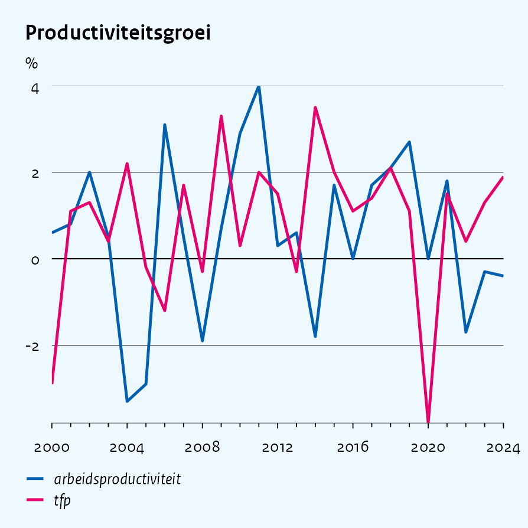

The added `scale_x_continuous()` shows the usual refinements for a year
axis: labelled breaks every few years plus small minor ticks for the
years in between.

# Column charts

`cpb_col()` covers stacked, dodged and horizontal bars. Stacked is the
default `position`:

``` r
sectoren <- c("industrie", "diensten", "landbouw", "overheid")
tw <- expand_grid(jaar   = 2023:2027,
                  sector = factor(sectoren, levels = sectoren)) |>
  mutate(waarde = round(runif(n(), 5, 25), 1))

cpb_col(tw, x = jaar, y = waarde, fill = sector,
  index = c(6, 5, 2, 4),
  title = "Toegevoegde waarde per sector",
  ylab  = "mld euro")
```

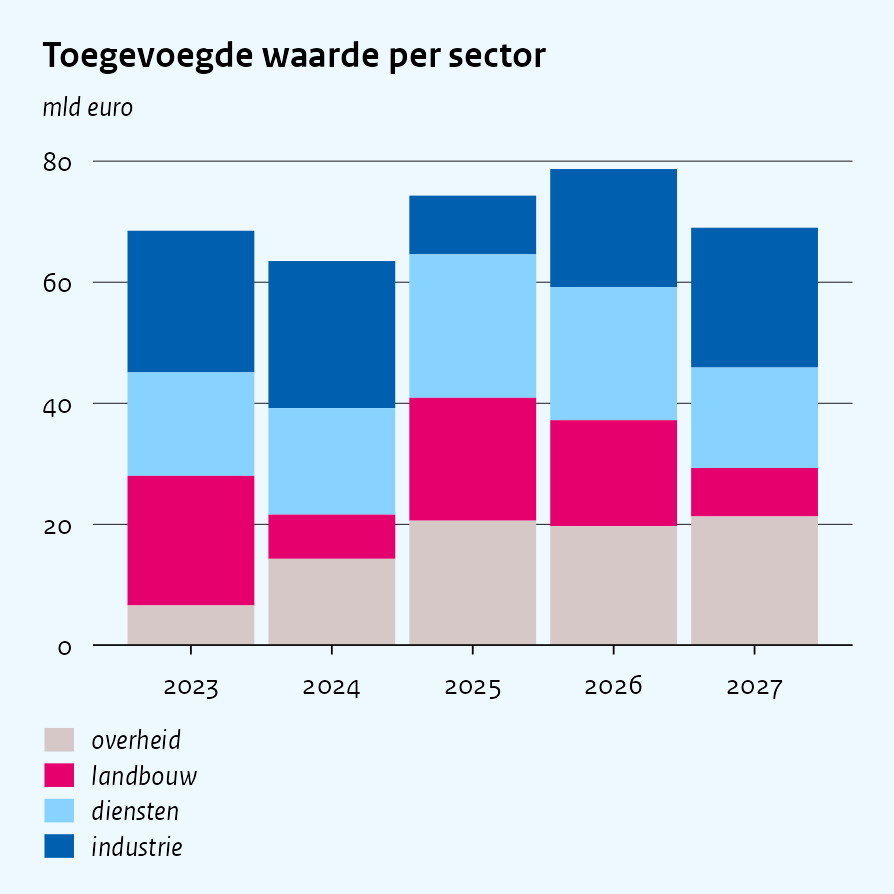

By default the fill legend is reversed (`reverse_legend = TRUE`), so it
reads in the same top-to-bottom order as the stack. For dodged bars,
switch that off so the legend follows the series order:

``` r
scenario <- expand_grid(regio    = c("Noord", "Oost", "Zuid", "West"),
                        scenario = c("basispad", "beleidsvariant")) |>
  mutate(effect = round(runif(n(), -2, 6), 1))

cpb_col(scenario, x = regio, y = effect, fill = scenario,
  position = "dodge",
  index = c(6, 2),
  reverse_legend = FALSE,
  title = "Effect per regio en scenario",
  ylab  = "% mutatie")
```

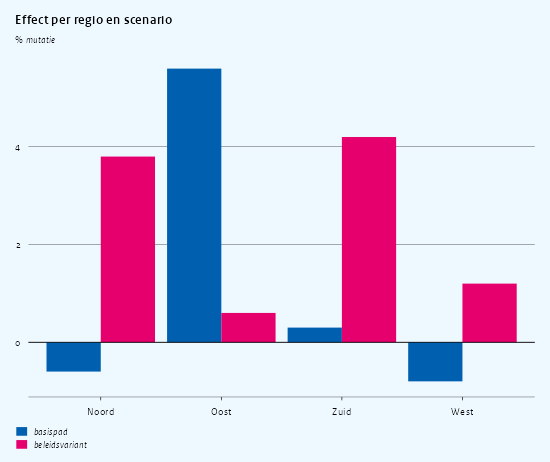

## Horizontal bars

`orientation = "horizontal"` flips the chart and moves the gridlines to
the value axis. Here `ylab` labels the *category* axis (still the
caption above the panel) and `xlab` labels the value axis at the bottom.
`pct_axis` formats the value axis with Dutch percentage labels,
`value_limits` fixes its range, and the panel starts exactly at the zero
axis:

``` r
groepen <- c("tot 120% wml", "120% wml - mod.", "1 - 1,5x mod.",
             "1,5 - 2x mod.", "2 - 3x mod.", "boven 3x mod.")
auto <- tibble(
  # reversed levels put the first-named group at the top after the flip
  inkomensgroep = factor(groepen, levels = rev(groepen)),
  share         = c(62, 35, 26, 19, 14, 13)
)

cpb_col(auto, x = inkomensgroep, y = share,
  orientation  = "horizontal",
  pct_axis     = TRUE,
  value_limits = c(0, 70),
  width        = 0.6,
  title = "Aandeel huishoudens zonder auto naar inkomen",
  ylab  = "inkomensgroep",
  xlab  = "huishoudens zonder auto")
```

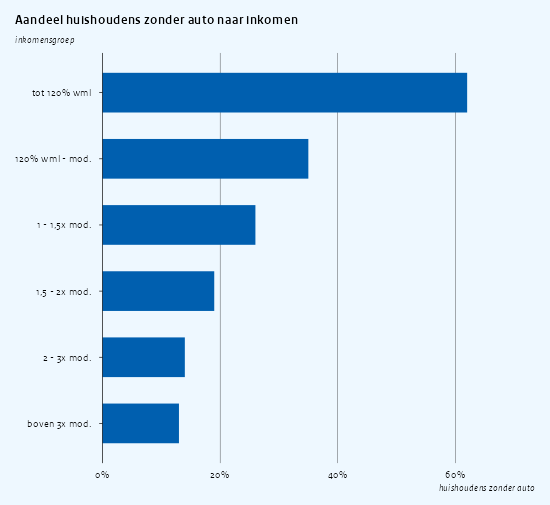

A horizontal *dodged* bar needs one extra trick. Under `coord_flip()`
the dodge draws the *last* factor level on top within each group, so to
show (say) 2021 above 2024 you reverse the `jaar` levels, swap the
`index` to keep each year its colour, and let `reverse_legend` restore
the reading order:

``` r
pv <- expand_grid(
  jaar          = factor(c(2021, 2024), levels = c(2024, 2021)),
  inkomensgroep = factor(groepen, levels = rev(groepen))
) |>
  mutate(share = c(10, 14, 19, 22, 26, 33,   # 2021
                   19, 25, 31, 38, 47, 59))  # 2024

cpb_col(pv, x = inkomensgroep, y = share, fill = jaar,
  position     = "dodge",
  orientation  = "horizontal",
  index        = c(2, 6),        # level order is (2024, 2021)
  value_breaks = seq(0, 70, 10),
  value_limits = c(0, 70),
  width        = 0.85,
  title = "Zonnepanelen naar inkomen",
  ylab  = "inkomensgroepen",
  xlab  = "aandeel binnen inkomensgroep (%)")
```

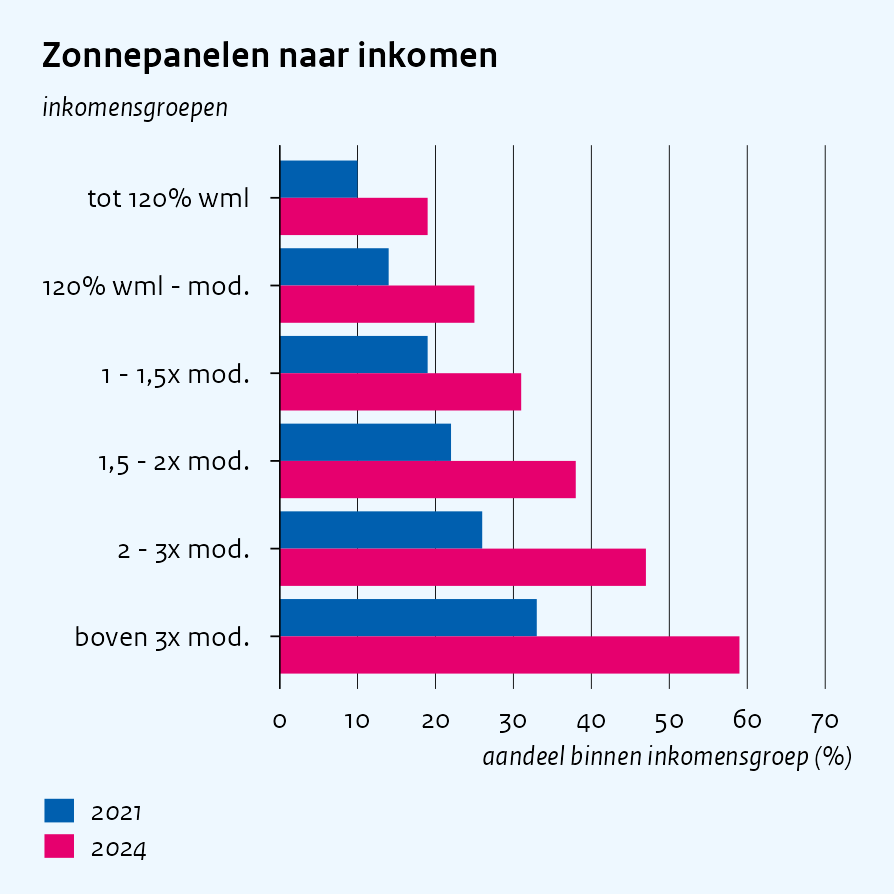

Note `value_breaks`: custom breaks for the value axis go through the
wrapper, not through a second `scale_y_continuous()`, which would
silently replace the wrapper’s percentage labels and zero-flush
expansion.

## Grouped categories on one shared axis

Pass `group` to organise the categories into blocks – a gap between the
groups, the group names in bold under the category labels, and *one*
shared value axis (no facets). Each category must belong to exactly one
group; tune the gap with `group_gap`:

``` r
zakkans <- tibble(
  cat   = factor(rep(c("jongen", "meisje", "laag", "hoog"), each = 2),
                 levels = c("jongen", "meisje", "laag", "hoog")),
  grp   = factor(rep(c("geslacht", "opleiding ouders"), each = 4),
                 levels = c("geslacht", "opleiding ouders")),
  serie = rep(c("als centraal examen meetelt",
                "als centraal examen niet meetelt"), 4),
  pct   = c(8.7, 8.7, 9.7, 5.1, 11.2, 8.0, 8.1, 6.0))

cpb_col(zakkans, x = cat, y = pct, fill = serie, group = grp,
  position = "dodge", index = c(6, 2), width = 0.75,
  value_breaks = seq(0, 12, 2), value_limits = c(0, 12),
  title = "VWO", ylab = "zakkans (%)")
```

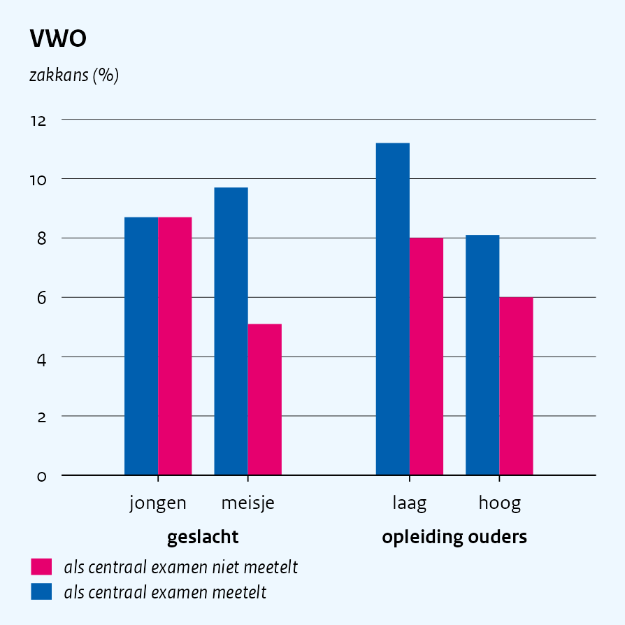

The group labels occupy the line an `xlab` would use, so the two cannot
be combined.

# Area charts

`cpb_area()` draws the recurring share-of-total-over-time figure. With
`pct_axis = TRUE` the y axis gets Dutch percentage labels:

``` r
bronnen <- c("gas", "elektriciteit", "warmte", "overig")
mix <- expand_grid(jaar = 2018:2027,
                   bron = factor(bronnen, levels = bronnen)) |>
  mutate(ruw = runif(n(), 1, 10)) |>
  mutate(aandeel = 100 * ruw / sum(ruw), .by = jaar)

cpb_area(mix, x = jaar, y = aandeel, fill = bron,
  pct_axis = TRUE,
  index    = c(6, 5, 2, 4),
  title    = "Energiemix van huishoudens",
  ylab     = "aandeel") +
  scale_x_continuous(breaks = seq(2018, 2027, 3), minor_breaks = 2018:2027,
                     guide = guide_axis(minor.ticks = TRUE))
```

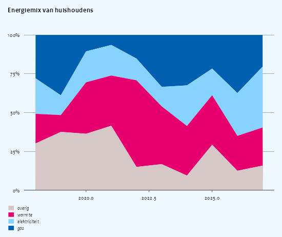

# Quantile boxplots

`cpb_box()` draws the CPB distributional figure: a box over the p25–p75
interquartile range with the median at p50, and thin errorbar whiskers
out to p5 and p95. It expects **precomputed quantile columns** (both
layers use `stat = "identity"`), so aggregate your microdata first:

``` r
groepen5 <- c("laagste 20%", "2e 20%", "midden 20%", "4e 20%", "hoogste 20%")
raw <- tibble(
  groep      = factor(rep(groepen5, each = 400), levels = groepen5),
  koopkracht = rnorm(2000, mean = rep(c(-3, -1.5, 0, 1.5, 3.5), each = 400), sd = 2)
)
kk <- raw |>
  summarise(
    p5  = quantile(koopkracht, 0.05),
    p25 = quantile(koopkracht, 0.25),
    p50 = quantile(koopkracht, 0.50),
    p75 = quantile(koopkracht, 0.75),
    p95 = quantile(koopkracht, 0.95),
    .by = groep
  )

cpb_box(kk, x = groep,
  p5 = p5, p25 = p25, p50 = p50, p75 = p75, p95 = p95,
  orientation = "horizontal",
  title    = "Koopkracht per inkomensgroep",
  subtitle = "inkomensgroep",
  ylab     = "% koopkrachtmutatie")
```

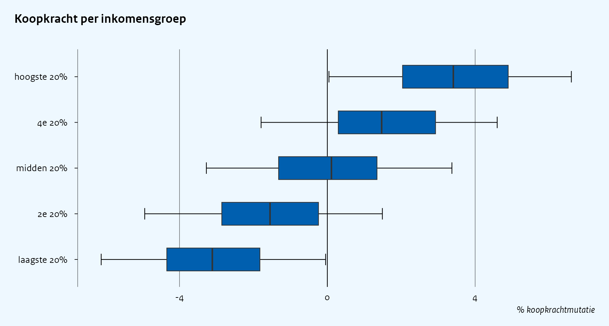

Boxes without a `fill` mapping are drawn in the CPB primary blue. Map
`fill` and pass a `position_dodge()` for grouped boxes – for example one
pair of years per income group:

``` r
kk2 <- expand_grid(kk, jaar = factor(c(2026, 2027))) |>
  mutate(across(p5:p95, \(q) q + (jaar == "2027") * 0.8))

cpb_box(kk2, x = groep,
  p5 = p5, p25 = p25, p50 = p50, p75 = p75, p95 = p95,
  fill     = jaar,
  position = position_dodge(width = 0.6),
  index    = c(6, 2),
  title    = "Koopkracht per jaar, 2026 en 2027",
  ylab     = "% koopkrachtmutatie") +
  scale_y_continuous(labels = label_number_nl())
```

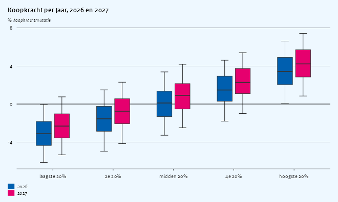

## Box styles

`box_style` selects how the boxes are drawn. Besides the default
`"ggcpb"` construction above there is `"james"`, the legacy plotter’s
box – borderless, plain capless whiskers, a black median line extending
past the box, and the median value printed above it – and `"modern"`,
the designer variant with light-blue boxes, a thick dark-blue median and
the quartile values printed below the box ends:

``` r
cpb_box(kk, x = groep,
  p5 = p5, p25 = p25, p50 = p50, p75 = p75, p95 = p95,
  box_style   = "modern",
  orientation = "horizontal",
  width       = 0.35,
  title    = "Koopkracht per inkomensgroep",
  subtitle = "inkomensgroep",
  ylab     = "% koopkrachtmutatie") +
  scale_y_continuous(labels = label_number_nl(accuracy = 0.1))
```

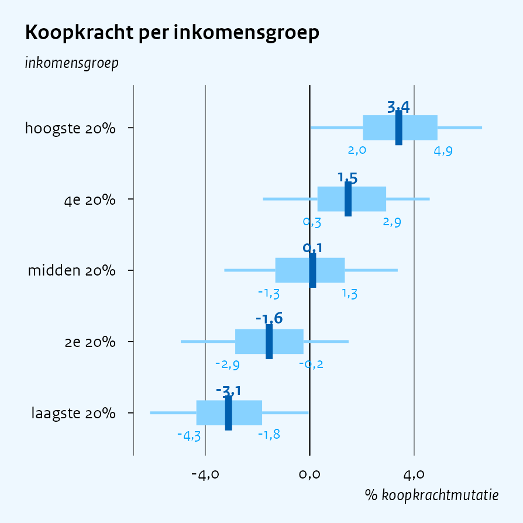

Both styles print value labels by default (`box_labels = FALSE` turns
them off, `label_accuracy` controls their rounding) and draw
single-colour boxes: a `fill` mapping is only supported by `"ggcpb"`.

## Vertical grouping

For the published distributional layout – categories organised under
bold group headings, all sharing one value axis – pass `group`. A group
whose only category carries the same name (like an “Alle huishoudens”
total) collapses onto its heading row. Combine with
`box_style = "james"` and a *vector* `fill_colour` (one colour per row)
to colour each group:

``` r
ink <- tribble(
  ~cat,                     ~grp,                   ~p50,
  "Alle huishoudens",       "Alle huishoudens",     0.09,
  "1-20%",                  "Inkomensgroepen",      0.02,
  "21-40%",                 "Inkomensgroepen",      0.07,
  "41-60%",                 "Inkomensgroepen",      0.07,
  "61-80%",                 "Inkomensgroepen",      0.06,
  "81-100%",                "Inkomensgroepen",      0.04,
  "Werkenden",              "Inkomensbron",         0.09,
  "Uitkeringsgerechtigden", "Inkomensbron",         0.04,
  "Gepensioneerden",        "Inkomensbron",         0.05) |>
  mutate(cat = factor(cat, levels = cat),
         grp = factor(grp, levels = unique(grp)),
         p25 = p50 - runif(n(), 0.02, 0.15), p75 = p50 + runif(n(), 0.02, 0.12),
         p5  = p25 - runif(n(), 0.1, 0.6),   p95 = p75 + runif(n(), 0.1, 0.6))

cpb_box(ink, x = cat, p5 = p5, p25 = p25, p50 = p50, p75 = p75, p95 = p95,
  group = grp, box_style = "james", orientation = "horizontal",
  fill_colour = c("#193c69", rep("#87d2ff", 5), rep("#e6006e", 3)),
  width = 0.45,
  title = "Inkomenseffecten plannen stelsel",
  ylab  = "verandering in 2025 (%)")
```

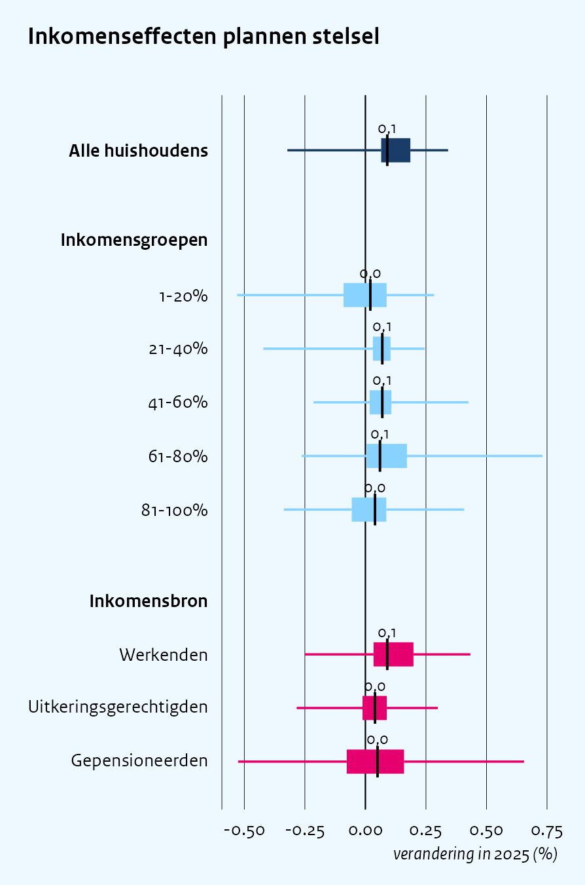

# Scatter plots

`cpb_scatter()` draws points in the house style. Without a `colour`
column the points are CPB blue; a *numeric* `colour` column gets the
continuous CPB gradient, a discrete one the discrete palette:

``` r
hh <- tibble(inkomen = round(rlnorm(400, log(2500), 0.35))) |>
  mutate(energierekening = round(90 + 0.04 * inkomen + rnorm(n(), 0, 35)),
         koopkracht      = round(rnorm(n(), (inkomen - 2500) / 1500, 2), 1))

cpb_scatter(hh, x = inkomen, y = energierekening, colour = koopkracht,
  title = "Energierekening naar inkomen",
  ylab  = "energierekening (euro per maand)",
  xlab  = "besteedbaar inkomen (euro per maand)",
  colourlab = "koopkracht (%)") +
  scale_x_continuous(labels = label_euro_nl())
```

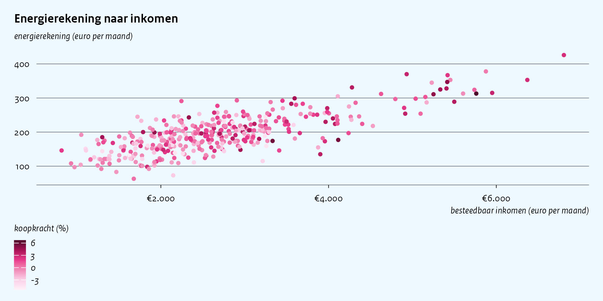

# Histograms

`cpb_hist()` bins a column of observations into house-blue bars with
white outlines; set `binwidth` or `bins`. Map `fill` for grouped
histograms:

``` r
duur <- tibble(maanden = round(rgamma(1200, 8, 0.6)))

cpb_hist(duur, x = maanden, binwidth = 2,
  title = "Verdeling van de duur",
  ylab  = "aantal",
  xlab  = "duur (maanden)")
```

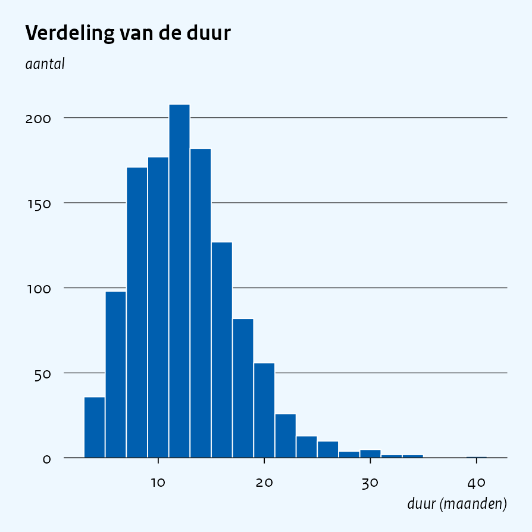

# Facets

Every wrapper accepts a `facet` column. Facets follow the house (legacy
nicerplot) convention: the facet title is a bold strip *below* each
panel, and every panel is a complete mini-figure with its own axes.
Control the grid with `facet_ncol` and shared-versus-free axis ranges
with `facet_scales` (`"fixed"` by default, so panels are directly
comparable):

``` r
regios <- expand_grid(regio = factor(c("stad", "platteland", "gemengd", "totaal"),
                                     levels = c("stad", "platteland", "gemengd", "totaal")),
                      groep = factor(c("laag", "midden", "hoog"),
                                     levels = c("laag", "midden", "hoog")),
                      jaar  = 2019:2025) |>
  mutate(waarde = round(2 + as.numeric(groep) + cumsum(rnorm(n(), 0, 0.3)), 1))

cpb_col(regios, x = jaar, y = waarde, fill = groep,
  position   = "dodge",
  facet      = regio,
  facet_ncol = 2,
  index      = c(6, 2, 5),
  title = "Ontwikkeling per regio",
  ylab  = "mld euro")
```

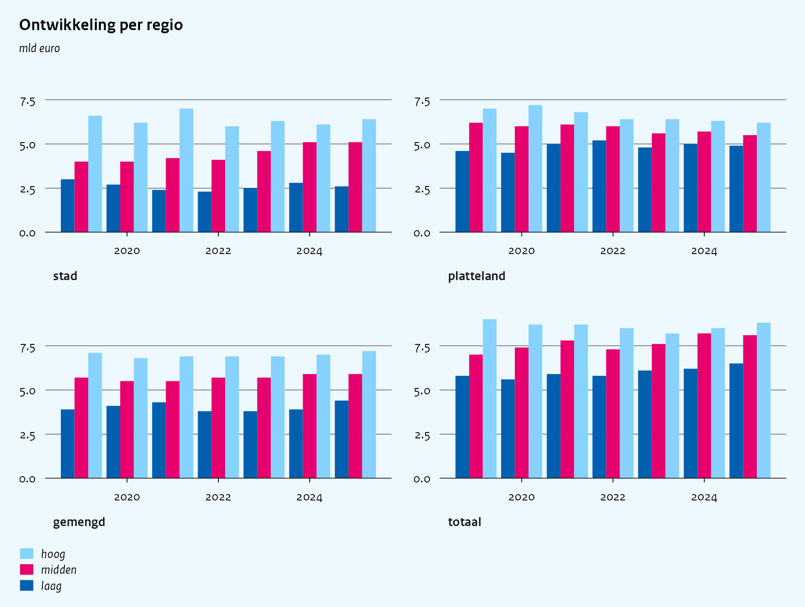

A faceted figure usually needs a taller canvas: pass an explicit
`height` to `save_cpb()` (here the figure is drawn 4.5 in tall on the
full-page width).

# Forecast windows and uncertainty bands

Time-series figures mark the forecast part of the axis with a
translucent window and a label – pass `forecast_x` (the x value where
the forecast starts) to `cpb_line()`, `cpb_col()` or `cpb_area()`, and
`forecast_label` to override the default `"raming"`. `cpb_line()` can
additionally draw an uncertainty band from `ymin`/`ymax` columns:

``` r
groeipad <- tibble(jaar = 2015:2027,
                   groei = round(rnorm(13, 1.5, 0.8), 1)) |>
  mutate(marge = c(rep(0, 9), 0.4, 0.9, 1.4, 1.8),
         lo = groei - marge, hi = groei + marge)

cpb_line(groeipad, x = jaar, y = groei, ymin = lo, ymax = hi,
  forecast_x = 2023.5,
  title = "Economische groei met onzekerheid",
  ylab  = "%") +
  scale_x_continuous(breaks = seq(2015, 2027, 3), minor_breaks = 2015:2027,
                     guide = guide_axis(minor.ticks = TRUE))
```

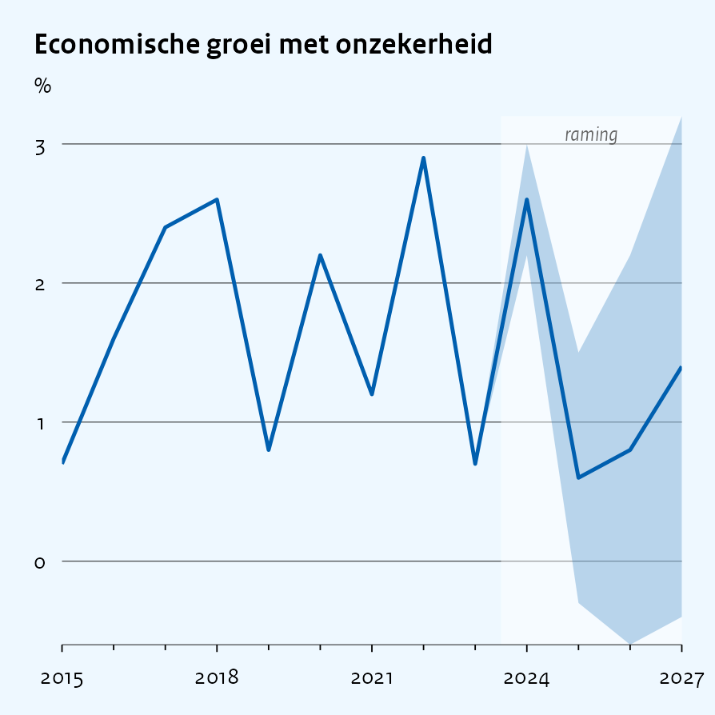

The window is drawn *underneath* the data and the label is centred in it
at the top of the panel; for bar charts pick a `forecast_x` between two
bars (e.g. `2025.5`) so no bar is cut.

# Maps

`cpb_map()` draws a value per Dutch municipality, COROP region or
province on bundled generalised CBS/Kadaster boundaries (2025, via
cartomap). Regions are joined by CBS code (`"GM0014"`, `"PV20"`) or by
name, whichever matches best; regions without a value are filled with
the CPB missing-value grey. Borders are hairlines in the background
colour, so regions read as tiles separated by light-blue seams:

``` r
gemeenten <- tibble(code = unique(cpb_nl_geo("gemeente")$code)) |>
  mutate(index = rnorm(n(), 100, 15))

cpb_map(gemeenten, region = code, value = index,
  title    = "Voorbeeldindex per gemeente",
  subtitle = "index (Nederland = 100)")
#> Warning in ggplot2::geom_polygon(colour = border_colour, linewidth =
#> border_linewidth, : Ignoring empty aesthetic: `colour`.
```

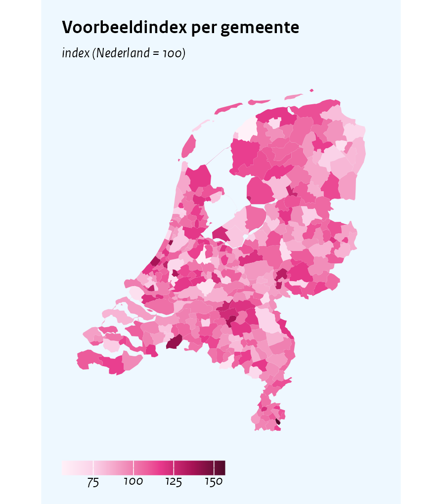

Numeric values get the CPB sequential gradient; a discrete value column
gets the discrete palettes. The raw boundary tables are available
through `cpb_nl_geo(level)` for anything the wrapper does not cover.

# Composing: a line over stacked columns

Because every wrapper returns a real `ggplot`, a decomposition chart –
stacked contribution columns with the total drawn as a line – is just
`cpb_col()` plus a `geom_line()` layer and a colour scale for the extra
series:

``` r
componenten <- c("kapitaal/uren", "arbeidssamenstelling", "tfp")
dec <- expand_grid(jaar = 2000:2024,
                   # reversed levels stack the first component nearest zero
                   component = factor(componenten, levels = rev(componenten))) |>
  mutate(bijdrage = round(rnorm(n(), mean = 0.4, sd = 0.9), 1))
totaal <- dec |>
  summarise(bijdrage = sum(bijdrage), .by = jaar)

cpb_col(dec, x = jaar, y = bijdrage, fill = component,
  position = "stack",
  index    = c(2, 5, 6),
  width    = 0.75,
  title    = "Opbouw productiviteitsgroei",
  ylab     = "%") +
  geom_line(
    data    = totaal,
    mapping = aes(x = jaar, y = bijdrage, colour = "arbeidsproductiviteit"),
    linewidth = 0.55, inherit.aes = FALSE
  ) +
  scale_colour_cpb_manual(index = 1) +
  labs(colour = NULL) +
  guides(fill   = guide_legend(reverse = TRUE, order = 1),
         colour = guide_legend(order = 2)) +
  theme(legend.box = "horizontal", legend.box.just = "top")
```

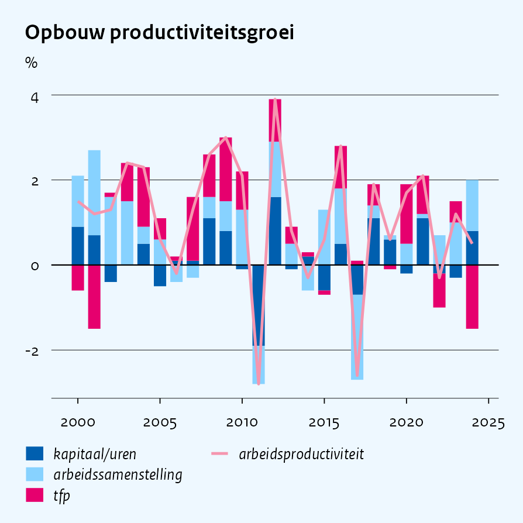

# Everything is a ggplot object

The wrappers do not draw anything – they *return* a `ggplot` object with
the theme and scales already applied. That means the full `ggplot2`
grammar stays available through `+`: extra geoms, annotations, scale
tweaks and further `theme()` overrides all layer on top of what the
wrapper built.

A dashed reference line with an italic annotation, on top of the
horizontal bar chart from before:

``` r
cpb_col(auto, x = inkomensgroep, y = share,
  orientation  = "horizontal",
  pct_axis     = TRUE,
  value_limits = c(0, 70),
  width        = 0.6,
  title = "Aandeel huishoudens zonder auto naar inkomen",
  ylab  = "inkomensgroep",
  xlab  = "huishoudens zonder auto") +
  geom_hline(yintercept = 24, linetype = "dashed",
             colour = "#666666", linewidth = 0.4) +
  annotate("text", x = 6.45, y = 24, label = "landelijk gemiddelde",
           hjust = -0.05, size = 2.0, colour = "#666666",
           family = cpb_font_family(), fontface = "italic")
```

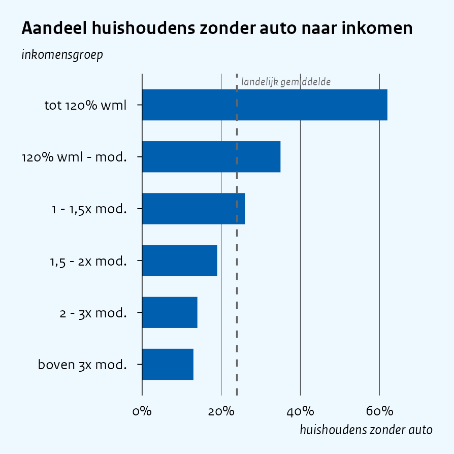

Note that under `coord_flip()` the value axis is still the `y`
aesthetic, so a reference line on the value axis is a `geom_hline()`.

Or mark a forecast window on a line chart with a shaded region, as the
published scenario figures do:

``` r
cpb_line(bbp, x = jaar, y = index,
  title = "Bruto binnenlands product",
  ylab  = "index (2015 = 100)") +
  annotate("rect", xmin = 2024.5, xmax = Inf, ymin = -Inf, ymax = Inf,
           fill = "white", alpha = 0.4) +
  annotate("text", x = 2026, y = 104, label = "raming",
           size = 2.2, colour = "#666666",
           family = cpb_font_family(), fontface = "italic") +
  geom_vline(xintercept = 2024.5, linetype = "dashed", linewidth = 0.3) +
  scale_x_continuous(breaks = seq(2015, 2027, 3), minor_breaks = 2015:2027,
                     guide = guide_axis(minor.ticks = TRUE))
```

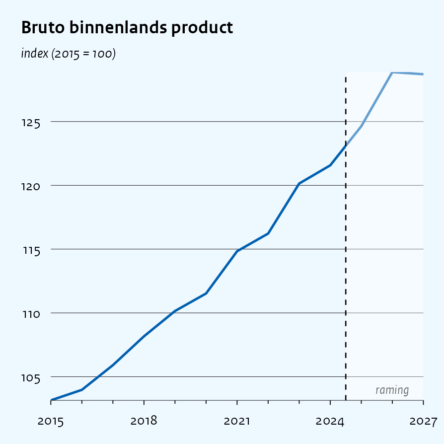

Later `+ theme(...)` calls override individual elements of `theme_cpb()`
the same way – see the per-figure margin and legend tweaks in
`inst/examples/smoke_test_plots.R`. The one thing *not* to add is a
second value-axis scale: use the wrapper’s `value_breaks`,
`value_limits` and `pct_axis` arguments instead, as noted above.

# Export

`save_cpb()` writes the figure at the strict CPB page widths –
`page = "half"` (2.98 in) or `page = "full"` (5.96 in) – through the
`ragg` device, so the bundled Rijksoverheid font renders correctly:

``` r
p <- cpb_line(bbp, x = jaar, y = index,
  title = "Bruto binnenlands product",
  ylab  = "index (2015 = 100)")

save_cpb("bbp.png", p, page = "half")
save_cpb("bbp_breed.png", p, page = "full", height = 3.2)
```

For a rendered gallery of all chart types against the published
reference figures, run `inst/examples/smoke_test_plots.R`.
