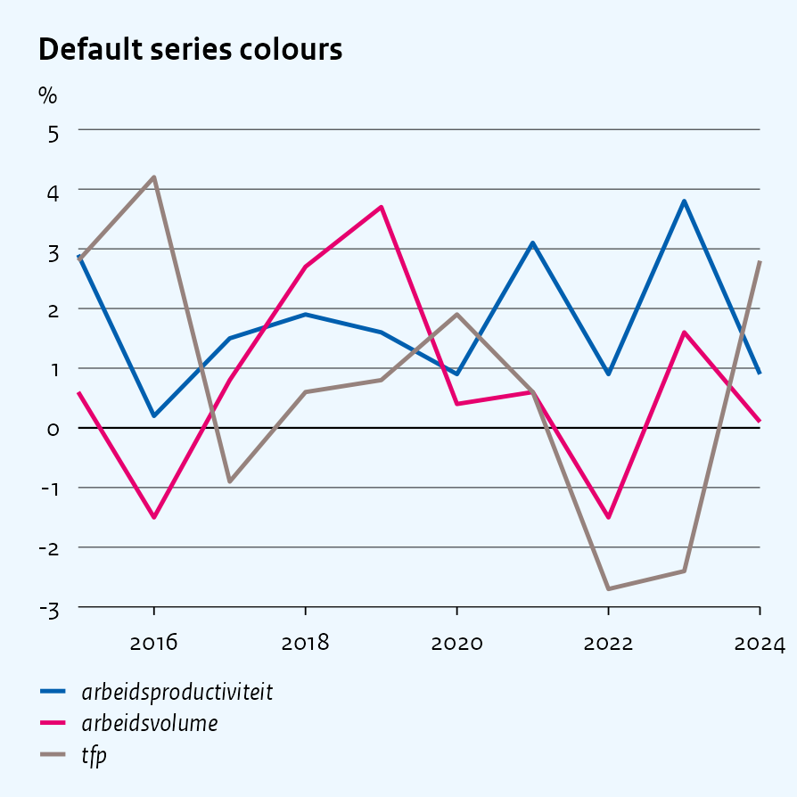
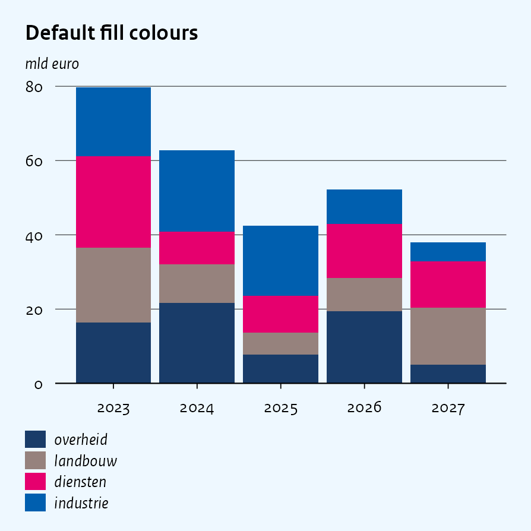
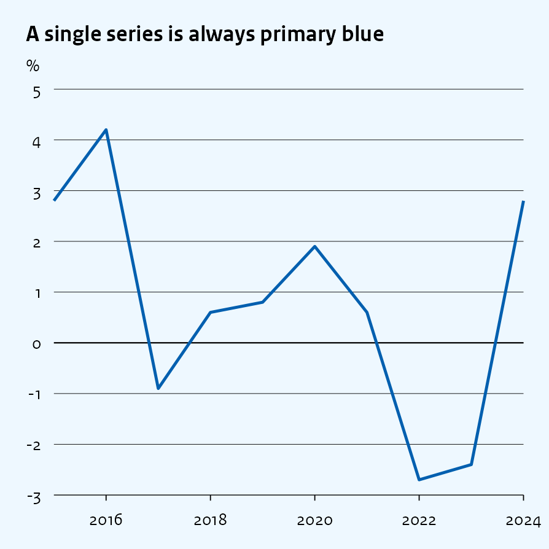
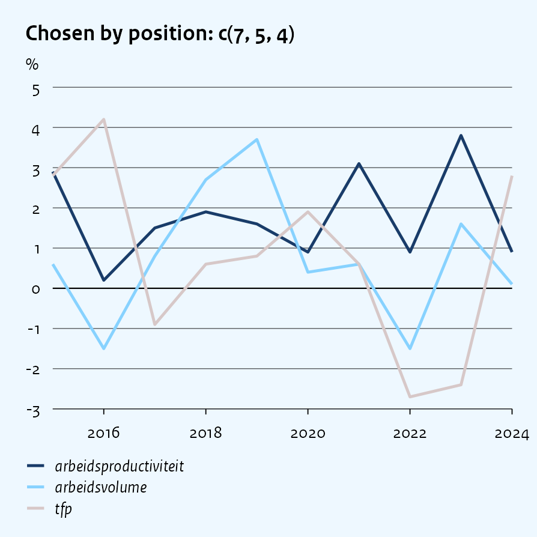
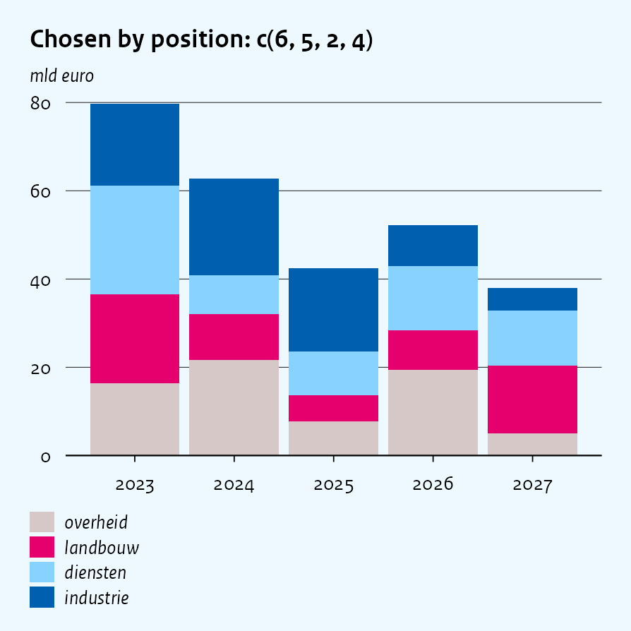
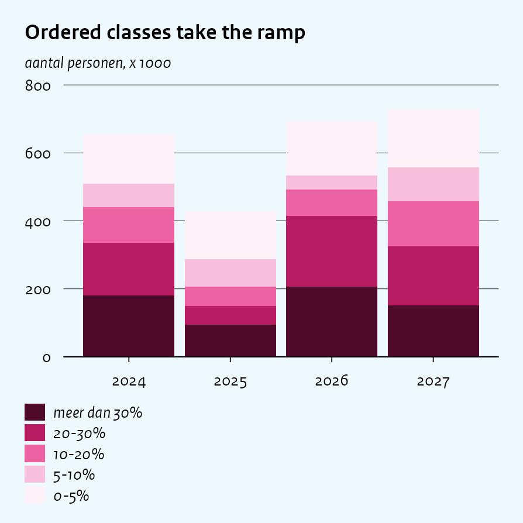
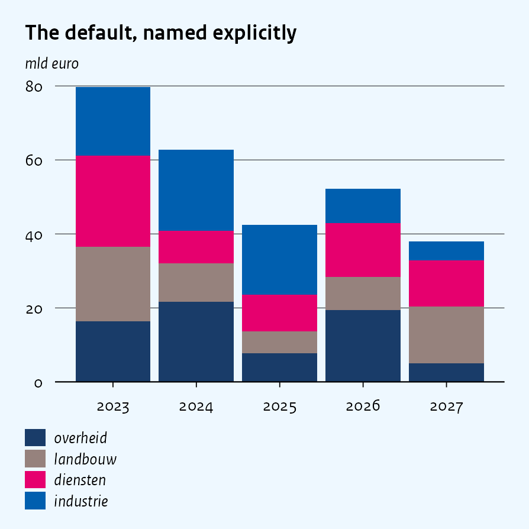
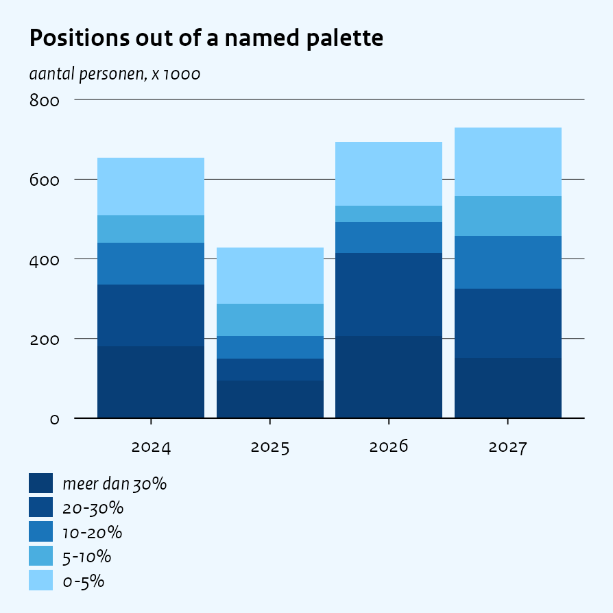
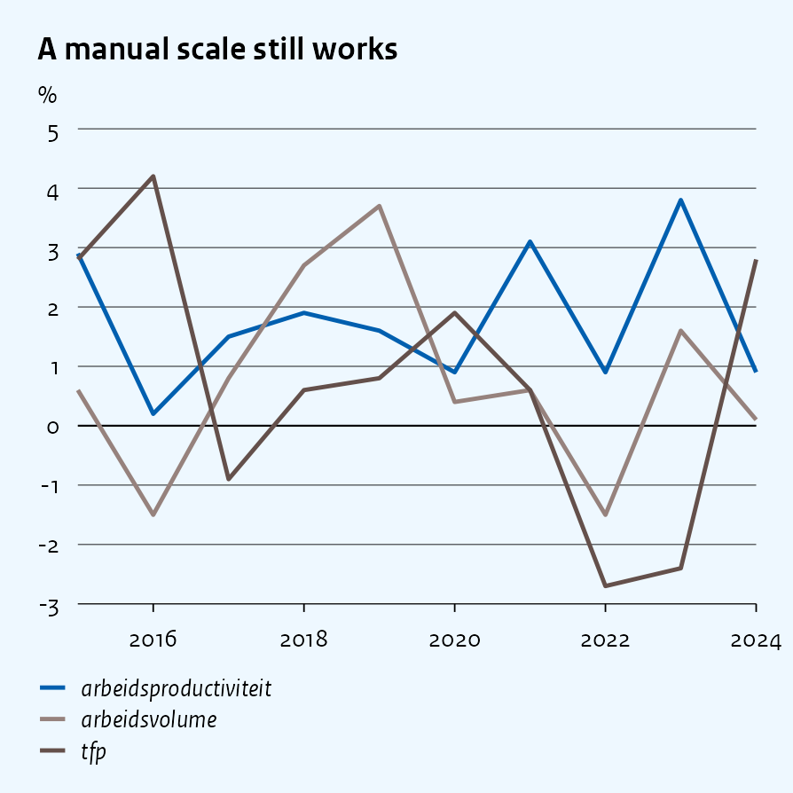
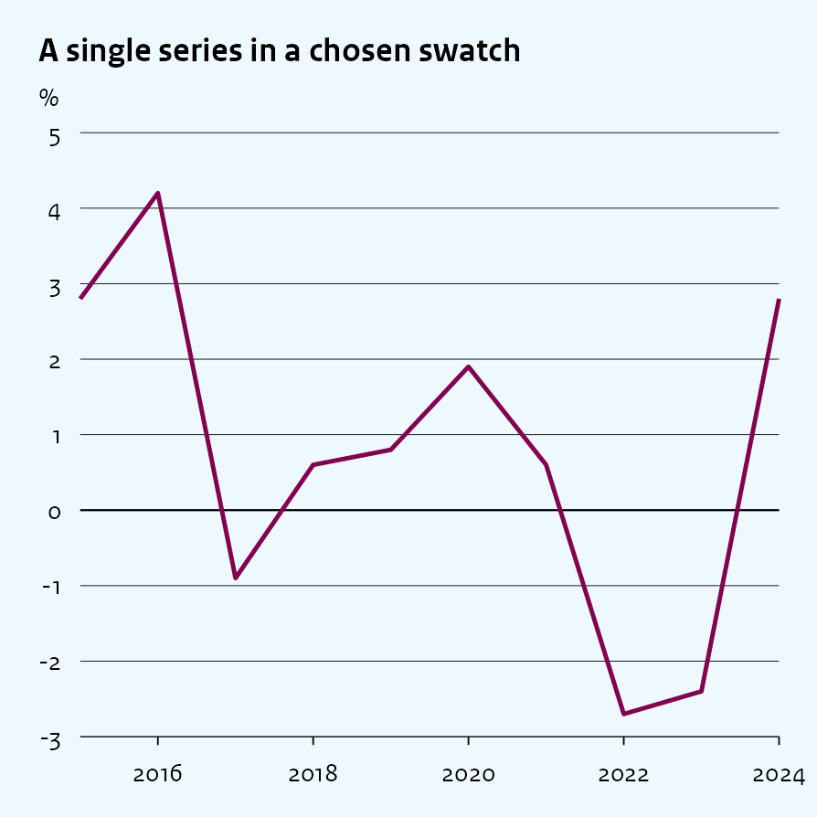

Colours
================

``` r
library(ggcpb)
library(ggplot2)
library(dplyr)
library(tidyr)
set.seed(42)
```

How series get their colours, and how to override them. Everything here
applies equally to `cpb_line()` and `cpb_col()`; the only difference is
the argument name, which follows the aesthetic being coloured:

- `colour_index` on the wrappers that map `colour` – `cpb_line()`,
  `cpb_scatter()`, `cpb_dot()`
- `fill_index` on the wrappers that map `fill` – `cpb_col()`,
  `cpb_area()`, `cpb_box()`, `cpb_hist()`, `cpb_map()`

`color_index` is accepted wherever `colour_index` is.

``` r
groei <- expand_grid(
  reeks = c("arbeidsproductiviteit", "tfp", "arbeidsvolume"),
  jaar  = 2015:2024
) |>
  mutate(waarde = round(rnorm(n(), mean = 1, sd = 1.4), 1))

sectoren <- c("industrie", "diensten", "landbouw", "overheid")
tw <- expand_grid(jaar   = 2023:2027,
                  sector = factor(sectoren, levels = sectoren)) |>
  mutate(waarde = round(runif(n(), 5, 25), 1))
```

# The default

Map a column to `colour` or `fill` and the series are coloured for you,
in the order the published figures use: **blue, magenta, taupe**, then
the remaining swatches. No argument needed.

``` r
cpb_line(groei, x = jaar, y = waarde, colour = reeks,
  title = "Default series colours",
  ylab  = "%")
```



The same order drives fills, so a line chart and a column chart of the
same series agree:

``` r
cpb_col(tw, x = jaar, y = waarde, fill = sector,
  title = "Default fill colours",
  ylab  = "mld euro")
```



A single series is not part of that cycle: it is drawn in the CPB
primary blue, which is why one-line and one-column figures look the same
as the first series of a multi-series one.

``` r
cpb_line(filter(groei, reeks == "tfp"), x = jaar, y = waarde,
  title = "A single series is always primary blue",
  ylab  = "%")
```



# Choosing swatches by position

The house palette is nine swatches. `cpb_cols()` pulls them out by
position, which is how CPB source scripts refer to them:

``` r
cpb_cols()
#>         1         2         3         4         5         6         7         8 
#> "#F596AF" "#e6006e" "#820050" "#d7c8c8" "#87d2ff" "#005faf" "#193c69" "#96827d" 
#>         9 
#> "#64504b"
```

Pass those positions to `colour_index` / `fill_index` to depart from the
default order – `c(6, 2)` is the recurring blue/magenta pair, `8` the
taupe used for a third, quieter series:

``` r
cpb_line(groei, x = jaar, y = waarde, colour = reeks,
  colour_index = c(7, 5, 4),
  title = "Chosen by position: c(7, 5, 4)",
  ylab  = "%")
```



``` r
cpb_col(tw, x = jaar, y = waarde, fill = sector,
  fill_index = c(6, 5, 2, 4),
  title = "Chosen by position: c(6, 5, 2, 4)",
  ylab  = "mld euro")
```



Position numbers stay stable regardless of the default order, so
`cpb_cols(6)` is the primary blue whatever else changes.

## When the order matters

Two cases where you will reach for explicit positions rather than the
default.

**Keeping a series on its colour.** When levels are reordered – to
control stacking, or because `coord_flip()` draws the last level first –
the default cycle follows the *level* order, so a series can change
colour between two charts of the same data. Naming positions pins each
series to its colour.

**Matching a figure you are reproducing.** A chart rebuilt from a
publication needs that publication’s colours, not the current default.

# Sequential shades

For ordered classes – income bands, intensity classes – the discrete
palette is the wrong tool: its colours are meant to be *distinct*, not
ranked. Pass `"continuous"` to switch to the sequential ramp, which runs
light to dark:

``` r
klassen <- c("0-5%", "5-10%", "10-20%", "20-30%", "meer dan 30%")
intensiteit <- expand_grid(jaar   = 2024:2027,
                           klasse = factor(klassen, levels = klassen)) |>
  mutate(n = round(runif(n(), 40, 220)))

cpb_col(intensiteit, x = jaar, y = n, fill = klasse,
  fill_index = "continuous",
  title = "Ordered classes take the ramp",
  ylab  = "aantal personen, x 1000")
```



`"discrete"` names the default explicitly, which is worth doing when a
chart sits next to a `"continuous"` one and you want the contrast to be
visible in the code:

``` r
cpb_col(tw, x = jaar, y = waarde, fill = sector,
  fill_index = "discrete",
  title = "The default, named explicitly",
  ylab  = "mld euro")
```



The keywords `"qualitative"`, `"sequential"`, `"discr"` and `"blues"`
name the underlying palettes directly, for the two ramps that have no
short name of their own.

# The palette argument

`palette` selects the same palettes and predates the keywords. Both
still work, so pick one per call: a keyword that contradicts an explicit
`palette` is an error rather than a silent winner.

``` r
cpb_col(tw, x = jaar, y = waarde, fill = sector,
  fill_index = "continuous",
  palette    = "qualitative")
#> Error:
#> ! `fill_index = "continuous"` and `palette = "qualitative"` both set the palette, and they disagree. Pass one of them.
```

`palette` is also the way to reach a palette while still picking
positions out of it, since `fill_index` can carry positions *or* a
palette name, not both at once:

``` r
cpb_col(intensiteit, x = jaar, y = n, fill = klasse,
  palette    = "blues",
  fill_index = c(2, 3, 4, 5, 6),
  title = "Positions out of a named palette",
  ylab  = "aantal personen, x 1000")
```



# Colours outside the palette

For a one-off colour that is not a house swatch, the wrappers return
plain `ggplot` objects, so an ordinary scale still applies:

``` r
cpb_line(groei, x = jaar, y = waarde, colour = reeks,
  title = "A manual scale still works",
  ylab  = "%") +
  scale_colour_manual(values = c("#005faf", "#96827d", "#64504b"))
#> Scale for colour is already present.
#> Adding another scale for colour, which will replace the existing scale.
```



For a single series, `line_colour` (and `fill_colour` on the column
wrappers) sets the one colour directly, without involving a scale at
all:

``` r
cpb_line(filter(groei, reeks == "tfp"), x = jaar, y = waarde,
  line_colour = cpb_cols(3),
  title = "A single series in a chosen swatch",
  ylab  = "%")
```



# Summary

| Goal                             | Argument                                |
|----------------------------------|-----------------------------------------|
| House colours, published order   | nothing – it is the default             |
| Specific swatches                | `colour_index` / `fill_index = c(6, 2)` |
| Ordered classes                  | `fill_index = "continuous"`             |
| Name the default explicitly      | `fill_index = "discrete"`               |
| Positions out of another palette | `palette =` plus positions              |
| One series, one colour           | `line_colour` / `fill_colour`           |
| Anything else                    | a plain `scale_*_manual()`              |
