ggcpb
================

``` r
library(ggcpb)
library(ggplot2)
library(dplyr)
#> 
#> Attaching package: 'dplyr'
#> The following object is masked from 'package:testthat':
#> 
#>     matches
#> The following objects are masked from 'package:stats':
#> 
#>     filter, lag
#> The following objects are masked from 'package:base':
#> 
#>     intersect, setdiff, setequal, union
```

This vignette walks through the composable core of `ggcpb` – the theme,
the discrete and continuous colour scales, manual palette selection, the
Dutch-locale formatters, and `save_cpb()` – and then through each
high-level wrapper function, reproducing a few representative figures
from CPB projects.

# The theme —-

`theme_cpb()` applies the CPB house style on top of
`ggplot2::theme_minimal()`: a fixed 9/8/7 pt type scale, a left-aligned
bold title, a CPB-blue plot background, and gridlines in the CPB grid
colour drawn on the value axis only.

``` r
pv_counts <- tibble(
  jaar = 2019:2023,
  aantal = c(120, 135, 128, 150, 162)
)

ggplot(pv_counts, aes(jaar, aantal)) +
  geom_col(fill = cpb_cols(6)) +
  labs(title = "Aantal PV-meldingen per jaar", x = NULL, y = "aantal") +
  theme_cpb()
```

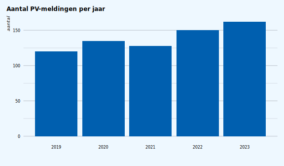<!-- -->

For a chart built with `coord_flip()`, pass `orientation = "horizontal"`
so the gridlines move to the value axis (now x) instead:

``` r
ggplot(pv_counts, aes(factor(jaar), aantal)) +
  geom_col(fill = cpb_cols(6)) +
  coord_flip() +
  labs(title = "Aantal PV-meldingen per jaar", x = NULL, y = "aantal") +
  theme_cpb(orientation = "horizontal")
```

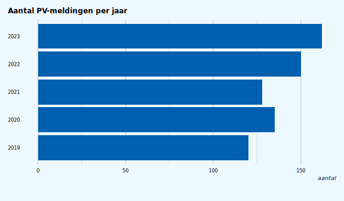<!-- -->

`grid` overrides the axis selection explicitly (`"both"`, `"none"`,
`"x"`, `"y"`), and `background = FALSE` (or the `theme_cpb_min()`
shorthand) drops the CPB background fill entirely – useful for small
multiples.

Most CPB publication figures were historically produced with the
internal base-R `nplot()` function, whose look differs in a few
systematic ways from the hand-rolled ggplot2 defaults above. The
`style = "nplot"` preset switches to that look in one argument, on
`theme_cpb()` and on every wrapper:

``` r
ggplot(pv_counts, aes(factor(jaar), aantal)) +
  geom_col(fill = cpb_cols(6)) +
  labs(title = "Aantal PV-meldingen per jaar", x = NULL, y = "aantal") +
  theme_cpb(style = "nplot")
```

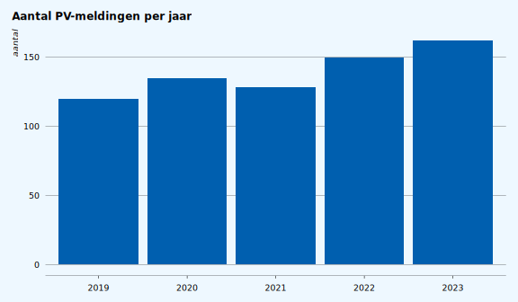<!-- -->

The preset stands for: hairline black gridlines at labelled breaks only
(`minor = FALSE`, `grid_colour = "black"`, `grid_linewidth = 0.1`),
black tick marks on the category axis (`ticks = TRUE`), 7 pt axis text,
0.45 cm legend keys, and a flush-left vertical legend at the bottom
(`legend = "bottom"`, `flush_legend = TRUE`). Each of these is also an
individual argument that overrides the preset. The wrappers additionally
take `zeroline`, the solid black line at zero on the value axis that
`nplot()` adds to bar, line and box figures; under `style = "nplot"` it
is drawn automatically whenever zero is on the value axis – see
`inst/examples/smoke_test_plots.R`, where every figure uses the preset,
including full recreations of published nplot figures.

# Discrete scales —-

`scale_fill_cpb_d()` / `scale_colour_cpb_d()` draw from one of the three
CPB palettes (`"qualitative"`, `"discr"`, `"sequential"`) and route `NA`
values to the CPB NA colour automatically.

``` r
pv_by_group <- tibble(
  jaar = rep(2021:2023, each = 2),
  groep = rep(c("huishoudens", "bedrijven"), 3),
  aantal = c(60, 40, 68, 52, 74, 58)
)

ggplot(pv_by_group, aes(jaar, aantal, fill = groep)) +
  geom_col(position = "stack") +
  labs(title = "PV-meldingen naar groep", x = NULL, y = "aantal", fill = NULL) +
  scale_fill_cpb_d() +
  theme_cpb()
```

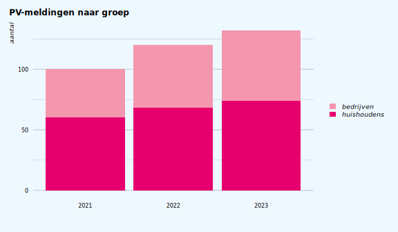<!-- -->

# Continuous scales —-

`scale_fill_cpb_c()` / `scale_colour_cpb_c()` build a full gradient
across the CPB sequential palette, from its lightest to its darkest
entry.

``` r
ggplot(mtcars, aes(wt, mpg, colour = hp)) +
  geom_point(size = 2) +
  labs(title = "Gewicht versus verbruik", x = "gewicht", y = "mpg", colour = "pk") +
  scale_colour_cpb_c() +
  theme_cpb()
```

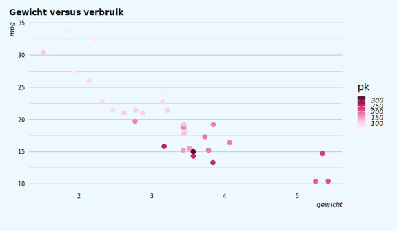<!-- -->

# Manual palette selection —-

`scale_fill_cpb_manual()` / `scale_colour_cpb_manual()` (and the
`cpb_cols()` accessor) select and order specific palette positions, for
the common case of a small, deliberately ordered subset – e.g. CPB
source scripts picking `cpb_colors[c(6, 2)]` for a blue/pink pair, or
`cpb_colors_scale[5:1]` for a reversed subset of the sequential ramp.

``` r
raming_vergelijking <- tibble(
  scenario = factor(c("basispad", "hoog scenario"), levels = c("basispad", "hoog scenario")),
  effect = c(-1.2, 2.4)
)

ggplot(raming_vergelijking, aes(scenario, effect, fill = scenario)) +
  geom_col() +
  labs(title = "Effect op koopkracht", x = NULL, y = "%-punt", fill = NULL) +
  scale_fill_cpb_manual(index = c(6, 2)) +
  theme_cpb()
```

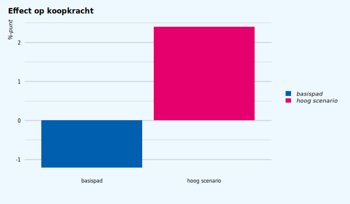<!-- -->

# Dutch-locale formatters —-

`label_euro_nl()`, `label_pct_nl()` and `label_number_nl()` wrap
`scales::label_*()` with the Dutch thousands separator (`.`) and decimal
mark (`,`).

``` r
kosten_vergelijking <- tibble(
  maatregel = factor(c("optie A", "optie B"), levels = c("optie A", "optie B")),
  kosten = c(1250000, 2100000)
)

ggplot(kosten_vergelijking, aes(maatregel, kosten, fill = maatregel)) +
  geom_col() +
  labs(title = "Geraamde kosten per maatregel", x = NULL, y = NULL, fill = NULL) +
  scale_y_continuous(labels = label_euro_nl()) +
  scale_fill_cpb_manual(index = c(6, 2)) +
  theme_cpb()
```

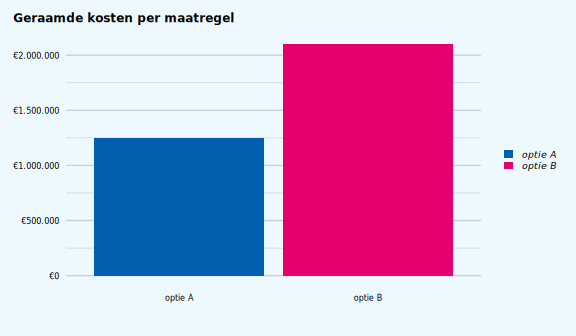<!-- -->

# Saving figures —-

`save_cpb()` enforces the CPB page widths (half page: 2.98 in, full
page: 5.96 in) and renders with `ragg::agg_png()` by default, so the
bundled CPB font renders correctly.

``` r
p <- ggplot(pv_counts, aes(jaar, aantal)) +
  geom_col(fill = cpb_cols(6)) +
  labs(title = "Aantal PV-meldingen per jaar", x = NULL, y = "aantal") +
  theme_cpb()

save_cpb("pv_counts.png", p, page = "half")
save_cpb("pv_counts_presentatie.png", p, page = "half", preset = "presentation")
```

# Wrapper layer —-

The wrapper functions take a data.frame (or data.table – it inherits
data.frame, so it works transparently), tidy-eval column arguments, and
return a real `ggplot` object with `theme_cpb()` and a CPB scale already
applied.

## `cpb_col()`: PV counts by year

``` r
cpb_col(pv_by_group, x = jaar, y = aantal, fill = groep) +
  labs(title = "PV-meldingen naar groep")
```

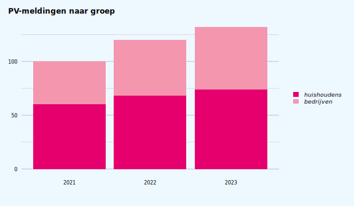<!-- -->

## `cpb_area()`: a quantile stacked-share area

``` r
energiebronnen <- tibble(
  jaar = rep(2019:2023, each = 2),
  bron = rep(c("gas", "elektriciteit"), 5),
  aandeel = c(62, 38, 60, 40, 57, 43, 52, 48, 49, 51)
)

cpb_area(energiebronnen, x = jaar, y = aandeel, fill = bron, pct_axis = TRUE) +
  labs(title = "Aandeel energiebronnen huishoudens")
```

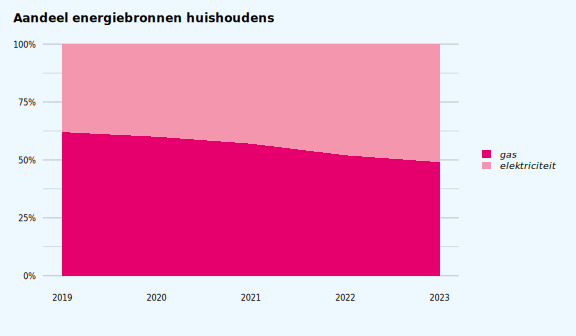<!-- -->

## `cpb_line()`: a raming comparison over time

``` r
ramingen <- tibble(
  jaar = rep(2019:2023, 2),
  raming = rep(c("CEP", "MEV"), each = 5),
  bbp_groei = c(1.8, 1.7, -3.8, 4.9, 4.5, 1.9, 1.6, -3.6, 4.6, 4.2)
)

cpb_line(ramingen, x = jaar, y = bbp_groei, colour = raming) +
  labs(title = "BBP-groeiraming, CEP versus MEV", y = "% groei")
```

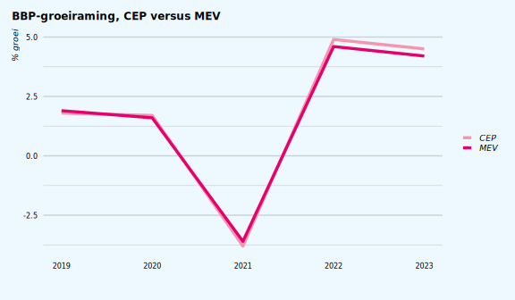<!-- -->

## `cpb_box()`: a euro-formatted comparison, and a p5-p95 distribution

``` r
cpb_col(kosten_vergelijking, x = maatregel, y = kosten, fill = maatregel, index = c(6, 2)) +
  scale_y_continuous(labels = label_euro_nl()) +
  labs(title = "Geraamde kosten per maatregel")
```

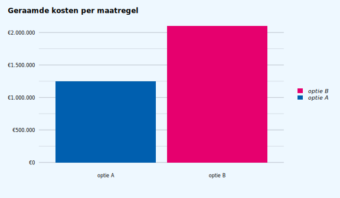<!-- -->

``` r
koopkracht_verdeling <- tibble(
  groep = factor(
    c("laag inkomen", "midden inkomen", "hoog inkomen"),
    levels = c("laag inkomen", "midden inkomen", "hoog inkomen")
  ),
  p5  = c(-8, -6, -4),
  p25 = c(-4, -3, -2),
  p50 = c(-2, -1, 0),
  p75 = c(0, 1, 2),
  p95 = c(3, 4, 5)
)

cpb_box(
  koopkracht_verdeling,
  x = groep, p5 = p5, p25 = p25, p50 = p50, p75 = p75, p95 = p95
) +
  labs(title = "Koopkrachteffect naar inkomensgroep", y = "%-punt")
```

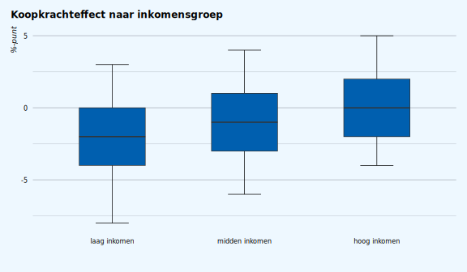<!-- -->
