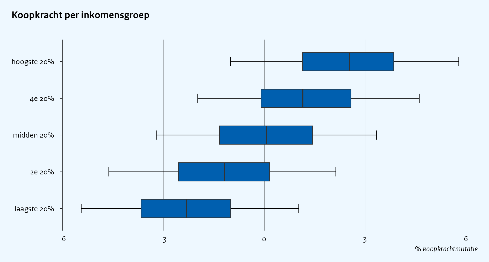
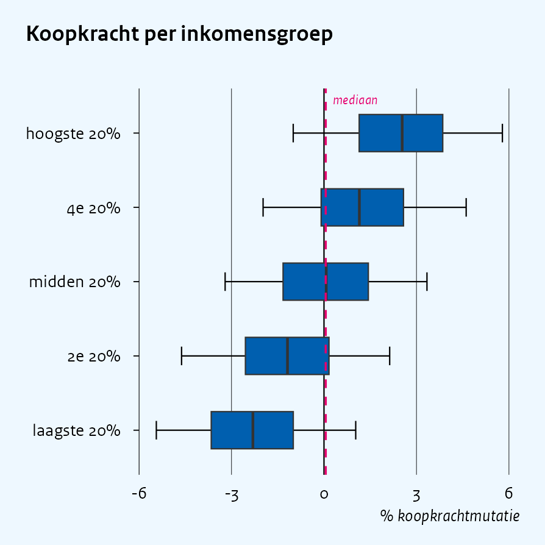
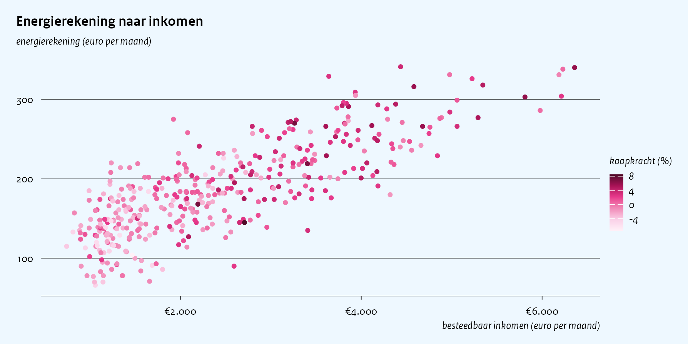
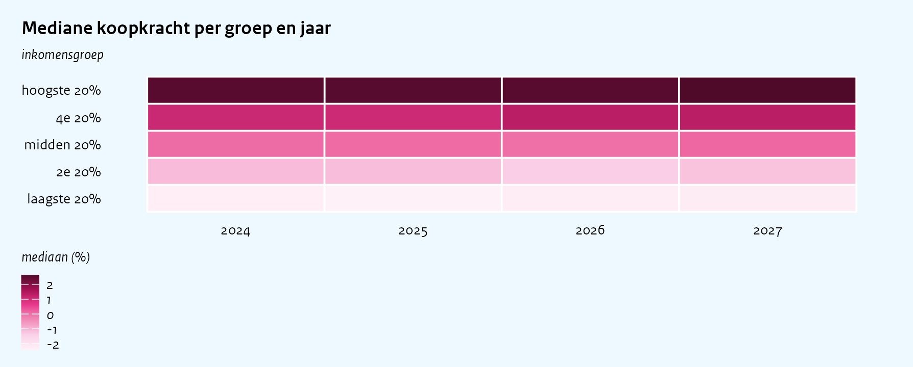
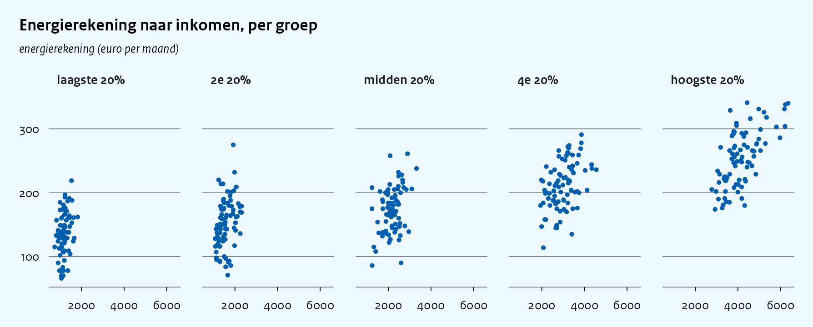

ggcpb: from data to publication-ready figure
================

This vignette follows one analysis from raw microdata to exported,
publication-ready figures. Along the way it uses each layer of the
package in the order you reach for them in practice: a **wrapper** for
the first draft, `+` layers with the **formatters and palette
accessors** to refine it, the **theme and scales directly** for a chart
type the wrappers do not cover, and `save_cpb()` to export at the strict
CPB page widths. For a catalogue of all chart types and their wrapper
calls (`cpb_line()`, `cpb_col()`, `cpb_area()`, `cpb_box()`,
`cpb_scatter()`, `cpb_hist()`), see `vignette("chart-types")`; for
grouped layouts, facets and maps see `vignette("layouts")`, and for
forecast windows, composing figures by hand and export see
`vignette("recipes")`.

``` r
library(ggcpb)
library(ggplot2)
library(dplyr)
set.seed(7)
```

# The case: purchasing power by income group

Simulated household microdata: five income quintiles with a
purchasing-power change, disposable income and a monthly energy bill per
household.

``` r
groepen <- c("laagste 20%", "2e 20%", "midden 20%", "4e 20%", "hoogste 20%")

huishoudens <- tibble(
  groep = factor(rep(groepen, each = 1000), levels = groepen)
) |>
  mutate(
    inkomen         = round(rlnorm(n(), log(2200) + 0.30 * (as.integer(groep) - 3), 0.20)),
    energierekening = round(90 + 0.04 * inkomen + rnorm(n(), 0, 35)),
    koopkracht      = rnorm(n(), mean = (as.integer(groep) - 3) * 1.2, sd = 2)
  )
```

# First draft: one wrapper call

The distributional figure CPB uses for this is the p5/p25/p50/p75/p95
quantile boxplot. `cpb_box()` wants precomputed quantiles, so aggregate
first, then one call gives a complete house-style figure – theme,
colours, zero line, flush legend layout, everything:

``` r
kk <- huishoudens |>
  summarise(
    p5  = quantile(koopkracht, 0.05),
    p25 = quantile(koopkracht, 0.25),
    p50 = quantile(koopkracht, 0.50),
    p75 = quantile(koopkracht, 0.75),
    p95 = quantile(koopkracht, 0.95),
    .by = groep
  )

p <- cpb_box(kk, x = groep,
  p5 = p5, p25 = p25, p50 = p50, p75 = p75, p95 = p95,
  orientation = "horizontal",
  title    = "Koopkracht per inkomensgroep",
  subtitle = "inkomensgroep",
  ylab     = "% koopkrachtmutatie")
p
```



# Refine with layers

The wrapper returned a plain `ggplot` object, so refinements are `+`
layers. Here: Dutch-locale value labels (`label_number_nl()`, one of the
formatters), and a dashed reference line at the population median with
an italic annotation – coloured via `cpb_cols()`, the raw palette
accessor, and set in the house font via `cpb_font_family()`:

``` r
mediaan <- median(huishoudens$koopkracht)

p +
  scale_y_continuous(labels = label_number_nl()) +
  geom_hline(yintercept = mediaan, linetype = "dashed",
             colour = cpb_cols(2), linewidth = 0.4) +
  annotate("text", x = 5.45, y = mediaan, label = "mediaan",
           hjust = -0.15, size = 2.0, colour = cpb_cols(2),
           family = cpb_font_family(), fontface = "italic")
```



(Under `coord_flip()` the value axis is still the `y` aesthetic, so the
reference line is a `geom_hline()`. For bar and column charts, set
custom value-axis breaks through the wrapper’s `value_breaks` argument
rather than a second `scale_y_continuous()` – see
`vignette("chart-types")`.)

# Another view, another wrapper

The same microdata seen as a scatter is one `cpb_scatter()` call – a
numeric `colour` column automatically gets the continuous CPB gradient:

``` r
steekproef <- slice_sample(huishoudens, n = 400)

cpb_scatter(steekproef, x = inkomen, y = energierekening, colour = koopkracht,
  title = "Energierekening naar inkomen",
  ylab  = "energierekening (euro per maand)",
  xlab  = "besteedbaar inkomen (euro per maand)",
  colourlab = "koopkracht (%)") +
  scale_x_continuous(labels = label_euro_nl())
```



# When there is no wrapper: the composable core

Not every figure has a wrapper. For anything else – here a heatmap of
the median purchasing-power change per income group and simulated year –
you build from raw `ggplot2` and apply the same core pieces the wrappers
use: `theme_cpb()`, a CPB colour scale (`scale_fill_cpb_c()` for a
continuous gradient), and the formatters. Two house conventions to carry
over yourself: the value-axis unit goes in `subtitle` (never a rotated
y-axis title), and the horizontal axis title sits at the bottom right.

``` r
raster <- huishoudens |>
  mutate(jaar = sample(2024:2027, n(), replace = TRUE)) |>
  summarise(mediaan = median(koopkracht), .by = c(groep, jaar))

ggplot(raster, aes(jaar, groep, fill = mediaan)) +
  geom_tile(colour = "white", linewidth = 0.4) +
  labs(title = "Mediane koopkracht per groep en jaar",
       subtitle = "inkomensgroep",
       x = NULL, y = NULL, fill = "mediaan (%)") +
  scale_fill_cpb_c() +
  theme_cpb(grid = "none", ticks = FALSE)
```



`theme_cpb()` takes the same layout arguments as the wrappers
(`?theme_cpb`), and `cpb_tokens()` exposes the raw design tokens
(palettes, background \#eef8ff, grid and NA colours) for anything the
scales do not cover.

Small multiples keep the same house dress – gridlines, blue background
and all – with `facet_wrap()` on top of `theme_cpb()`:

``` r
ggplot(steekproef, aes(inkomen, energierekening)) +
  geom_point(size = 0.5, colour = cpb_cols(6)) +
  facet_wrap(~ groep, nrow = 1) +
  labs(title = "Energierekening naar inkomen, per groep",
       subtitle = "energierekening (euro per maand)",
       x = NULL, y = NULL) +
  theme_cpb()
```



# Export

`save_cpb()` writes the figure at the strict CPB page widths –
`page = "half"` (2.98 in) or `page = "full"` (5.96 in) – through the
`ragg` device, so the bundled Rijksoverheid font (registered
automatically on load; see `cpb_register_fonts()`) renders correctly:

``` r
save_cpb("koopkracht.png", p, page = "half")
save_cpb("koopkracht_breed.png", p, page = "full", height = 3.2)
```

The half/full widths are the only ones `save_cpb()` accepts: a stray
`width = 8` fails loudly instead of silently producing an off-spec
figure. Text sizes in `theme_cpb()` are absolute points, so the canvas
size is part of the design – draw at 2.98/5.96 in and scale the
*display*, never the figure.
