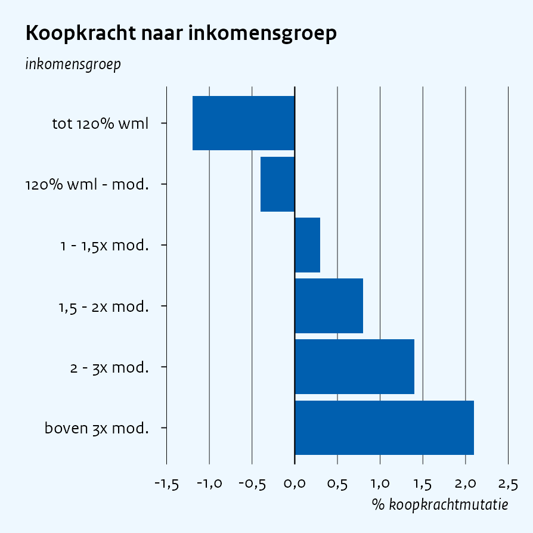
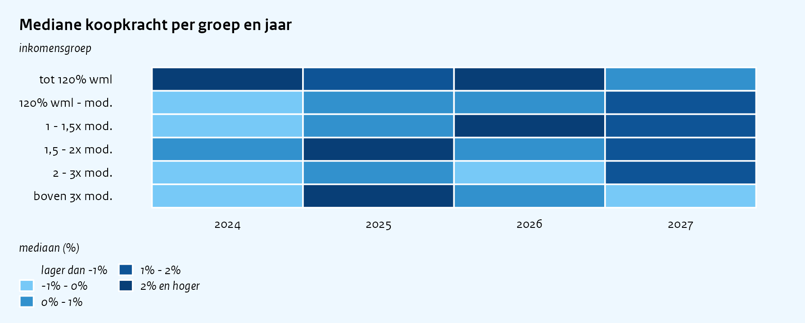

Setup
================

ggcpb encodes the CPB house plotting style on a ggplot2 backend. It has
two layers, and this vignette shows the basic idea of both:

- **Wrappers** (`cpb_line()`, `cpb_col()`, `cpb_box()`, …): one call
  gives a complete house-style figure – theme, colours, zero line, flush
  legend, Dutch number formats. Every wrapper *returns* a plain `ggplot`
  object, so the full ggplot2 grammar stays available through `+`.
- **The composable core** (`theme_cpb()`, the `scale_*_cpb_*()` scales,
  palettes, formatters, fonts): the pieces the wrappers are built from,
  for any figure without a wrapper.

The other vignettes go deeper:
[`vignette("chart-types")`](chart-types.md) for the default chart per
type, [`vignette("layout")`](layout.md) for facets and grouped axes,
[`vignette("annotation")`](annotation.md) for reference lines and
forecast windows, [`vignette("boxplots")`](boxplots.md) for the
box-plot styles, and [`vignette("maps")`](maps.md) for choropleths of
the Netherlands.

``` r
library(ggcpb)
library(ggplot2)
library(dplyr)
set.seed(7)
```

# One wrapper call

The standard CPB income groups, with a purchasing-power change per group
and year:

``` r
groepen <- c("tot 120% wml", "120% wml - mod.", "1 - 1,5x mod.",
             "1,5 - 2x mod.", "2 - 3x mod.", "boven 3x mod.")

kk <- tibble(
  # reversed levels put the first-named group at the top after the flip
  groep      = factor(groepen, levels = rev(groepen)),
  koopkracht = c(-1.2, -0.4, 0.3, 0.8, 1.4, 2.1)
)

p <- cpb_col(kk, x = groep, y = koopkracht,
  orientation = "horizontal",
  title = "Koopkracht naar inkomensgroep",
  ylab  = "inkomensgroep",
  xlab  = "% koopkrachtmutatie")
p
```



One call, one finished figure: bold title, italic caption line, black
hairline gridlines on the value axis, ticks on the category axis, the
black zero line, and the CPB blue – all house defaults, no styling
arguments needed.

# It is still a ggplot

Because the wrapper returned a real `ggplot` object, refining it is
ordinary ggplot2: `+` a layer, a scale, an annotation. Here a dashed
reference line in the house magenta (`cpb_cols(2)`), labelled in the
bundled house font:

``` r
p +
  geom_hline(yintercept = 0.9, linetype = "dashed",
             colour = cpb_cols(2), linewidth = 0.4) +
  annotate("text", x = 6.4, y = 0.9, label = "raming",
           hjust = -0.15, size = 2.0, colour = cpb_cols(2),
           family = cpb_font_family(), fontface = "italic")
```


(Under `coord_flip()` the value axis is still the `y` aesthetic, so the
reference line is a `geom_hline()`. More annotation patterns in
[`vignette("annotation")`](annotation.md).)

# Without a wrapper: the theme and scales directly

Not every figure has a wrapper. For anything else you build from raw
`ggplot2` and apply the same core pieces the wrappers use:
`theme_cpb()`, a CPB colour scale, and the Dutch-locale formatters. Two
house conventions to carry over yourself: the value-axis unit goes in
`subtitle` (never a rotated y-axis title), and the horizontal axis title
sits at the bottom right.

The fill here is *binned* rather than a continuous gradient: `cpb_cut()`
turns the numeric values into classes with Dutch labels (“lager dan
-1%”, “-1% - 0%”, …), which `scale_fill_cpb_d(palette = "blues")` then
colours light-to-dark. Binned classes read off a choropleth or heatmap
far more reliably than a gradient does. Because that produces a stack of
short keys, `guide_legend(ncol = 2)` lays them out in two columns
instead of one tall one – the wrappers expose the same thing as
`legend_ncol`.

Two settings keep the legend showing the *whole* scale. `drop = FALSE`
keeps a class with no observations in the legend rather than dropping
it, and `show.legend = TRUE` makes ggplot2 draw that class’s coloured
glyph: by default it blanks the key of any level absent from the data,
leaving a label with no swatch beside it. The wrappers set
`show.legend = TRUE` on their layers already, so this only needs saying
when you build the layer yourself.

``` r
raster <- expand.grid(groep = factor(groepen, levels = rev(groepen)),
                      jaar  = 2024:2027) |>
  mutate(mediaan = round(rnorm(n(), 0.5, 1), 1))

ggplot(raster, aes(jaar, groep,
                   fill = cpb_cut(mediaan, c(-Inf, -1, 0, 1, 2, Inf),
                                  labeller = label_pct_nl()))) +
  geom_tile(colour = "white", linewidth = 0.4, show.legend = TRUE) +
  labs(title = "Mediane koopkracht per groep en jaar",
       subtitle = "inkomensgroep",
       x = NULL, y = NULL, fill = "mediaan (%)") +
  scale_fill_cpb_d(palette = "blues", drop = FALSE) +
  guides(fill = guide_legend(ncol = 2)) +
  theme_cpb(grid = "none", ticks = FALSE)
```



`theme_cpb()` takes the same layout arguments as the wrappers
(`?theme_cpb`), and `cpb_tokens()` exposes the raw design tokens
(palettes, background, grid and NA colours) for anything the scales do
not cover.

# Export

`save_cpb()` writes the figure at the strict CPB page widths –
`page = "half"` (2.98 in) or `page = "full"` (5.96 in) – through the
`ragg` device, so the bundled Rijksoverheid font (registered
automatically on load; see `cpb_register_fonts()`) renders correctly:

``` r
save_cpb("koopkracht.png", p, page = "half")
save_cpb("koopkracht_breed.png", p, page = "full", height = 3.2)
```

The half/full widths are the only ones `save_cpb()` accepts: a stray
`width = 8` fails loudly instead of silently producing an off-spec
figure. Text sizes in `theme_cpb()` are absolute points, so the canvas
size is part of the design – draw at 2.98/5.96 in and scale the
*display*, never the figure. Height defaults to the report height; pass
`height` for taller figures (grouped boxes, facets) or
`preset = "presentation"`.
