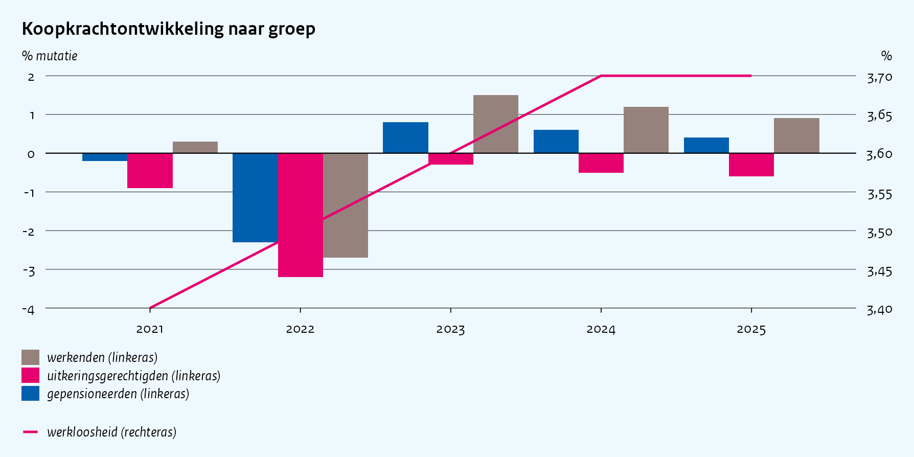
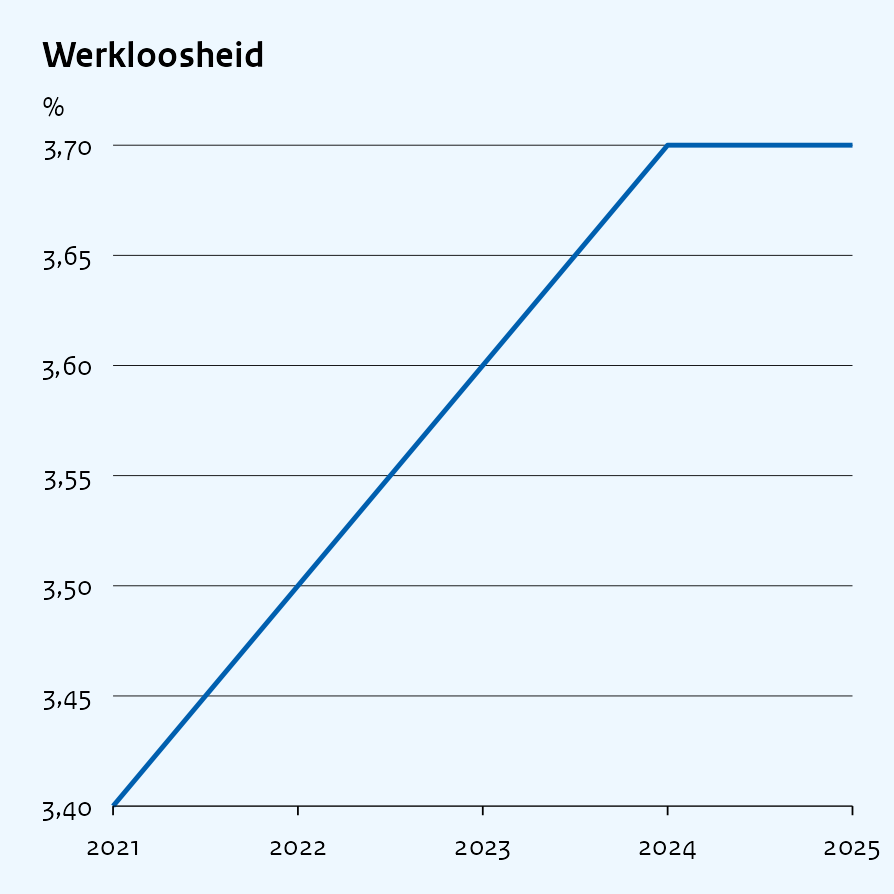

Building figures from CSV files
================

``` r
library(ggcpb)
```

# Introduction

Most figures in this package are built by calling one of its functions
directly in R code. This vignette describes an alternative based on two
CSV files, a data file and a parameter file.

The data file contains the data used in the figures. The parameter file
specifies which figures to create and how they should be configured. The
`import_csv()` function reads both files and creates the figures.

This approach is useful when figure specifications need to be kept
separate from R code, for example when the data and figure settings are
maintained outside an R script.

# The data file

The data file can be any CSV file containing the variables needed by the
figures. For this example, the package includes
`import_example_data.csv`.

``` r
data_csv <- system.file(
  "extdata",
  "import_example_data.csv",
  package = "ggcpb"
)
```

The file can be read in the usual way:

``` r
read.csv(data_csv)
#>    jaar                  groep koopkracht werkloosheid
#> 1  2021              werkenden        0.3          3.4
#> 2  2021        gepensioneerden       -0.2          3.4
#> 3  2021 uitkeringsgerechtigden       -0.9          3.4
#> 4  2022              werkenden       -2.7          3.5
#> 5  2022        gepensioneerden       -2.3          3.5
#> 6  2022 uitkeringsgerechtigden       -3.2          3.5
#> 7  2023              werkenden        1.5          3.6
#> 8  2023        gepensioneerden        0.8          3.6
#> 9  2023 uitkeringsgerechtigden       -0.3          3.6
#> 10 2024              werkenden        1.2          3.7
#> 11 2024        gepensioneerden        0.6          3.7
#> 12 2024 uitkeringsgerechtigden       -0.5          3.7
#> 13 2025              werkenden        0.9          3.7
#> 14 2025        gepensioneerden        0.4          3.7
#> 15 2025 uitkeringsgerechtigden       -0.6          3.7
```

The important point for the import method is that the parameter file
refers to variables by their column names. For example, if a parameter
contains `jaar`, `import_csv()` looks for a column named `jaar` in the
data file.

# The parameter file

The parameter file determines which figures are created. Each figure has
a `plot_type` and an `id`, together with the settings required for that
plot type.

The example parameter file is `import_example_params.csv`.

``` r
params_csv <- system.file(
  "extdata",
  "import_example_params.csv",
  package = "ggcpb"
)
```

This example uses the horizontal layout:

    plot_type,id,title,x,y,fill,ylab,position,sec_y,sec_type,sec_label,sec_ylab,create
    col,koopkracht,Koopkrachtontwikkeling naar groep,jaar,koopkracht,groep,% mutatie,dodge,werkloosheid,line,werkloosheid,%,y
    line,werkloosheid,Werkloosheid,jaar,werkloosheid,,%,,,,,,y

The same content, split on the comma and shown as a table:

| plot_type | id | title | x | y | fill | ylab | position | sec_y | sec_type | sec_label | sec_ylab | create |
|:---|:---|:---|:---|:---|:---|:---|:---|:---|:---|:---|:---|:---|
| col | koopkracht | Koopkrachtontwikkeling naar groep | jaar | koopkracht | groep | % mutatie | dodge | werkloosheid | line | werkloosheid | % | y |
| line | werkloosheid | Werkloosheid | jaar | werkloosheid |  | % |  |  |  |  |  | y |

Each row describes one figure. The column names are parameter names.

Some parameters refer to columns in the data file. For example:

- `x`, `y`, `fill` and `sec_y` are column references.
- `title`, `ylab` and `position` are literal values.

The distinction is important. `y,koopkracht` means that the `y` variable
should be taken from the `koopkracht` column, while `ylab,% mutatie`
supplies the text `% mutatie` directly.

# Creating the figures

Once the two files are available, pass them to `import_csv()`:

``` r
tmp_params <- tempfile(fileext = ".csv")
file.copy(params_csv, tmp_params, overwrite = TRUE)

figs <- import_csv(data_csv, tmp_params)
```

When the parameter file contains multiple figures, `import_csv()`
returns a named list. The names come from the `id` parameter.

The `koopkracht` figure has a second value axis (`sec_y`), and its right
side caption is only placed exactly by `save_cpb()`. Printed directly,
an approximate placement is shown instead, close but not exact, since at
that point the figure has not actually been saved yet to measure
against. So, rather than printing it directly, it is written out through
`save_cpb()` first and shown from that file:

``` r
path <- tempfile(fileext = ".png")
save_cpb(path, figs$koopkracht, page = "full")
```



`werkloosheid` has no second axis, so it can be shown directly:

``` r
figs$werkloosheid
```


In normal use, the data and parameter files can be stored in an ordinary
writable folder. The temporary copy above is only needed here because
the example parameter file is part of the installed package.

# One figure per parameter file

There is a second parameter file layout for cases where one parameter
file describes a single figure.

In the horizontal layout, each row is a figure and each column is a
parameter. In the vertical layout, each row is a parameter and the two
columns contain the parameter name and its value.

For example, the following describes a line chart:

``` r
params_vertical <- tempfile(fileext = ".csv")

writeLines(c(
  "plot_type,line",
  "title,Werkloosheid",
  "x,jaar",
  "y,werkloosheid",
  "ylab,%"
), params_vertical)

cat(readLines(params_vertical), sep = "\n")
#> plot_type,line
#> title,Werkloosheid
#> x,jaar
#> y,werkloosheid
#> ylab,%
```

The first column contains the parameter names:

```
plot_type
title
x
y
ylab
```

The second column contains their values:

```
line
Werkloosheid
jaar
werkloosheid
%
```

This layout can be convenient when a figure has many parameters, because
each setting has its own row.

When the parameter file describes one figure, `import_csv()` returns
that figure directly rather than a named list.

``` r
fig_vertical <- import_csv(data_csv, params_vertical)
```



# Handling problems

A parameter can be left blank. In that case, the default value is used.

If a parameter is not valid for the selected `plot_type`, it is ignored
and the default is used. These cases produce a warning.

If a figure cannot be created, for example because a column referenced
by a parameter does not exist in the data file, that figure is skipped.
Other figures in the same parameter file are still created.

Each call to `import_csv()` also writes a log file next to the parameter
file. The log records figures that were created or skipped and any
parameter problems.

# Run the import without opening R

The same CSV based method can also be used without opening R.

The `cpb_import_kit()` function creates a ready to use folder
containing:

- a data file
- a parameter file
- a script for Windows
- a script for a Mac

After editing the data and parameter files, run the appropriate script.
It reads both files and saves the resulting figures as images.

Running the script again after changing either CSV file produces updated
figures.

R and `ggcpb` must still be installed on the computer running the
script.

# Appendix: Parameter values

The available parameters depend on the `plot_type`. The complete list is
stored in `parameter_settings.csv`.

``` r
ref_csv <- system.file(
  "extdata",
  "parameter_settings.csv",
  package = "ggcpb"
)
```

The file gives the available parameters, their kind, default values and
examples.

| plot_type | setting | kind | default | example |
|:---|:---|:---|:---|:---|
| col | x | column (from data_csv) | (required) | jaar |
| col | y | column (from data_csv) | (required) | koopkracht |
| col | fill | column (from data_csv) |  | groep |
| col | fill_colour | literal |  | \#005faf |
| col | group | column (from data_csv) |  | sector |
| col | group_gap | literal | 0.8 | 0.8 |
| col | position | literal | stack/dodge/fill (default: stack) | stack/dodge/fill (default: stack) |
| col | orientation | literal | vertical/horizontal (default: vertical) | vertical/horizontal (default: vertical) |
| col | sec_y | column (from data_csv) |  | werkloosheid |
| col | sec_type | literal | line/point/col (default: line) | line/point/col (default: line) |
| col | sec_limits | literal |  | 0;100 |
| col | sec_label | literal |  | naam van de tweede reeks |
| col | sec_ylab | literal |  | eenheid van de rechteras |
| col | sec_colour | literal |  | \#e6006e |
| col | sec_linewidth | literal | 0.55 | 0.55 |
| col | sec_points | literal | FALSE | FALSE |
| col | sec_point_size | literal | 1.6 | 1.6 |
| col | sec_col_width | literal | 0.3 | 0.3 |
| col | sec_accuracy | literal |  | 0.1 |
| col | palette | literal | qualitative | qualitative |
| col | fill_index | literal |  | 2;6 |
| col | index | literal |  | gebruik colour_index of fill_index in plaats hiervan |
| col | pct_axis | literal | FALSE | FALSE |
| col | value_accuracy | literal |  | 0.1 |
| col | value_breaks | literal |  | 0;25;50;75;100 |
| col | value_limits | literal |  | 0;100 |
| col | value_labels | literal | FALSE | FALSE |
| col | x_lim | literal |  | 2015;2025 |
| col | x_lim_follow_data | literal | FALSE | FALSE |
| col | forecast_x | literal |  | 2025 |
| col | forecast_label | literal | raming | raming |
| col | reverse_legend | literal | TRUE | TRUE |
| col | legend_ncol | literal |  | 2 |
| col | facet | column (from data_csv) |  | regio |
| col | facet_ncol | literal |  | 2 |
| col | facet_scales | literal | fixed | fixed |
| col | legend | literal | bottom | bottom |
| col | zeroline | literal | TRUE | TRUE |
| col | minor | literal | FALSE | FALSE |
| col | ticks | literal | TRUE | TRUE |
| col | flush_legend | literal | TRUE | TRUE |
| col | axis_text_size | literal | 7 | 7 |
| col | legend_key_size | literal |  | 0.3 |
| col | grid_colour | literal | black | black |
| col | grid_linewidth | literal | 0.1 | 0.1 |
| col | title | literal |  | Titel van de figuur |
| col | subtitle | literal |  | ondertitel (vervangt de standaard eenheid boven de figuur) |
| col | xlab | literal |  | eenheid onderaan de x-as |
| col | ylab | literal |  | % mutatie |
| col | filllab | literal |  | titel van de vullingslegenda |
| area | x | column (from data_csv) | (required) | jaar |
| area | y | column (from data_csv) | (required) | koopkracht |
| area | fill | column (from data_csv) | (required) | groep |
| area | sec_y | column (from data_csv) |  | werkloosheid |
| area | sec_type | literal | line/point/col (default: line) | line/point/col (default: line) |
| area | sec_limits | literal |  | 0;100 |
| area | sec_label | literal |  | naam van de tweede reeks |
| area | sec_ylab | literal |  | eenheid van de rechteras |
| area | sec_colour | literal |  | \#e6006e |
| area | sec_linewidth | literal | 0.55 | 0.55 |
| area | sec_points | literal | FALSE | FALSE |
| area | sec_point_size | literal | 1.6 | 1.6 |
| area | sec_col_width | literal | 0.3 | 0.3 |
| area | sec_accuracy | literal |  | 0.1 |
| area | palette | literal | qualitative | qualitative |
| area | fill_index | literal |  | 2;6 |
| area | index | literal |  | gebruik colour_index of fill_index in plaats hiervan |
| area | pct_axis | literal | FALSE | FALSE |
| area | value_accuracy | literal |  | 0.1 |
| area | value_breaks | literal |  | 0;25;50;75;100 |
| area | value_limits | literal |  | 0;100 |
| area | x_lim | literal |  | 2015;2025 |
| area | x_lim_follow_data | literal | FALSE | FALSE |
| area | forecast_x | literal |  | 2025 |
| area | forecast_label | literal | raming | raming |
| area | reverse_legend | literal | TRUE | TRUE |
| area | legend_ncol | literal |  | 2 |
| area | facet | column (from data_csv) |  | regio |
| area | facet_ncol | literal |  | 2 |
| area | facet_scales | literal | fixed | fixed |
| area | legend | literal | bottom | bottom |
| area | zeroline | literal | TRUE | TRUE |
| area | minor | literal | FALSE | FALSE |
| area | ticks | literal | TRUE | TRUE |
| area | flush_legend | literal | TRUE | TRUE |
| area | axis_text_size | literal | 7 | 7 |
| area | legend_key_size | literal |  | 0.3 |
| area | grid_colour | literal | black | black |
| area | grid_linewidth | literal | 0.1 | 0.1 |
| area | title | literal |  | Titel van de figuur |
| area | subtitle | literal |  | ondertitel (vervangt de standaard eenheid boven de figuur) |
| area | xlab | literal |  | eenheid onderaan de x-as |
| area | ylab | literal |  | % mutatie |
| area | filllab | literal |  | titel van de vullingslegenda |
| line | x | column (from data_csv) | (required) | jaar |
| line | y | column (from data_csv) | (required) | koopkracht |
| line | colour | column (from data_csv) |  | groep |
| line | line_colour | literal |  | \#005faf |
| line | linewidth | literal | 0.55 | 0.55 |
| line | points | literal | FALSE | FALSE |
| line | point_size | literal | 1.1 | 1.1 |
| line | sec_y | column (from data_csv) |  | werkloosheid |
| line | sec_type | literal | line/point/col (default: line) | line/point/col (default: line) |
| line | sec_limits | literal |  | 0;100 |
| line | sec_label | literal |  | naam van de tweede reeks |
| line | sec_ylab | literal |  | eenheid van de rechteras |
| line | sec_colour | literal |  | \#e6006e |
| line | sec_linewidth | literal |  | 0.55 |
| line | sec_points | literal | FALSE | FALSE |
| line | sec_point_size | literal | 1.6 | 1.6 |
| line | sec_col_width | literal | 0.3 | 0.3 |
| line | sec_accuracy | literal |  | 0.1 |
| line | palette | literal | qualitative | qualitative |
| line | colour_index | literal |  | 2;6 |
| line | color_index | literal |  | 2;6 |
| line | index | literal |  | gebruik colour_index of fill_index in plaats hiervan |
| line | pct_axis | literal | FALSE | FALSE |
| line | value_accuracy | literal |  | 0.1 |
| line | value_breaks | literal |  | 0;25;50;75;100 |
| line | value_limits | literal |  | 0;100 |
| line | x_lim | literal |  | 2015;2025 |
| line | x_lim_follow_data | literal | TRUE | TRUE |
| line | ymin | column (from data_csv) |  | ondergrens |
| line | ymax | column (from data_csv) |  | bovengrens |
| line | forecast_x | literal |  | 2025 |
| line | forecast_label | literal | raming | raming |
| line | reverse_legend | literal | FALSE | FALSE |
| line | legend_ncol | literal |  | 2 |
| line | facet | column (from data_csv) |  | regio |
| line | facet_ncol | literal |  | 2 |
| line | facet_scales | literal | fixed | fixed |
| line | legend | literal | bottom | bottom |
| line | zeroline | literal |  | TRUE |
| line | minor | literal | FALSE | FALSE |
| line | ticks | literal | TRUE | TRUE |
| line | flush_legend | literal | TRUE | TRUE |
| line | axis_text_size | literal | 7 | 7 |
| line | legend_key_size | literal |  | 0.3 |
| line | grid_colour | literal | black | black |
| line | grid_linewidth | literal | 0.1 | 0.1 |
| line | title | literal |  | Titel van de figuur |
| line | subtitle | literal |  | ondertitel (vervangt de standaard eenheid boven de figuur) |
| line | xlab | literal |  | eenheid onderaan de x-as |
| line | ylab | literal |  | % mutatie |
| line | colourlab | literal |  | titel van de kleurenlegenda |
| box | x | column (from data_csv) | (required) | jaar |
| box | p5 | column (from data_csv) | (required) | p5 |
| box | p25 | column (from data_csv) | (required) | p25 |
| box | p50 | column (from data_csv) | (required) | p50 |
| box | p75 | column (from data_csv) | (required) | p75 |
| box | p95 | column (from data_csv) | (required) | p95 |
| box | mean | column (from data_csv) |  | gemiddelde |
| box | fill | column (from data_csv) |  | groep |
| box | fill_colour | literal |  | \#005faf |
| box | group | column (from data_csv) |  | sector |
| box | group_gap | literal | 0.7 | 0.7 |
| box | box_style | literal | ggcpb/james/modern/dot (default: ggcpb) | ggcpb/james/modern/dot (default: ggcpb) |
| box | dot_labels | literal |  | p5:onderste 5%;p95:bovenste 5% |
| box | box_labels | literal |  | TRUE |
| box | label_accuracy | literal | 0.1 | 0.1 |
| box | width | literal | 0.5 | 0.5 |
| box | linewidth | literal | 0.25 | 0.25 |
| box | palette | literal | qualitative | qualitative |
| box | fill_index | literal |  | 2;6 |
| box | index | literal |  | gebruik colour_index of fill_index in plaats hiervan |
| box | pct_axis | literal | FALSE | FALSE |
| box | value_accuracy | literal |  | 0.1 |
| box | value_breaks | literal |  | 0;25;50;75;100 |
| box | value_limits | literal |  | 0;100 |
| box | value_axis | literal | bottom/top (default: bottom) | bottom/top (default: bottom) |
| box | x_lim | literal |  | 2015;2025 |
| box | x_lim_follow_data | literal | TRUE | TRUE |
| box | orientation | literal | vertical/horizontal (default: vertical) | vertical/horizontal (default: vertical) |
| box | sec_y | column (from data_csv) |  | werkloosheid |
| box | sec_type | literal | line/point/col (default: line) | line/point/col (default: line) |
| box | sec_limits | literal |  | 0;100 |
| box | sec_label | literal |  | naam van de tweede reeks |
| box | sec_ylab | literal |  | eenheid van de rechteras |
| box | sec_colour | literal |  | \#e6006e |
| box | sec_linewidth | literal | 0.55 | 0.55 |
| box | sec_points | literal | FALSE | FALSE |
| box | sec_point_size | literal | 1.6 | 1.6 |
| box | sec_col_width | literal | 0.3 | 0.3 |
| box | sec_accuracy | literal |  | 0.1 |
| box | facet | column (from data_csv) |  | regio |
| box | facet_ncol | literal |  | 2 |
| box | facet_scales | literal | fixed | fixed |
| box | legend | literal | bottom | bottom |
| box | reverse_legend | literal | FALSE | FALSE |
| box | legend_ncol | literal |  | 2 |
| box | zeroline | literal |  | TRUE |
| box | minor | literal | FALSE | FALSE |
| box | ticks | literal | TRUE | TRUE |
| box | flush_legend | literal | TRUE | TRUE |
| box | axis_text_size | literal | 7 | 7 |
| box | legend_key_size | literal |  | 0.3 |
| box | grid_colour | literal | black | black |
| box | grid_linewidth | literal | 0.1 | 0.1 |
| box | title | literal |  | Titel van de figuur |
| box | subtitle | literal |  | ondertitel (vervangt de standaard eenheid boven de figuur) |
| box | xlab | literal |  | eenheid onderaan de x-as |
| box | ylab | literal |  | % mutatie |
| box | filllab | literal |  | titel van de vullingslegenda |
| dot | x | column (from data_csv) | (required) | jaar |
| dot | y | column (from data_csv) | (required) | koopkracht |
| dot | lower | column (from data_csv) | (required) | ondergrens |
| dot | upper | column (from data_csv) | (required) | bovengrens |
| dot | colour | column (from data_csv) |  | groep |
| dot | point_colour | literal |  | \#e6006e |
| dot | group | column (from data_csv) |  | sector |
| dot | group_gap | literal | 0.7 | 0.7 |
| dot | size | literal | 1.4 | 1.4 |
| dot | linewidth | literal | 0.4 | 0.4 |
| dot | cap_width | literal | 0.25 | 0.25 |
| dot | orientation | literal | horizontal/vertical (default: horizontal) | horizontal/vertical (default: horizontal) |
| dot | sec_y | column (from data_csv) |  | werkloosheid |
| dot | sec_type | literal | line/point/col (default: line) | line/point/col (default: line) |
| dot | sec_limits | literal |  | 0;100 |
| dot | sec_label | literal |  | naam van de tweede reeks |
| dot | sec_ylab | literal |  | eenheid van de rechteras |
| dot | sec_colour | literal |  | \#e6006e |
| dot | sec_linewidth | literal | 0.55 | 0.55 |
| dot | sec_points | literal | FALSE | FALSE |
| dot | sec_point_size | literal | size | size |
| dot | sec_col_width | literal | 0.3 | 0.3 |
| dot | sec_accuracy | literal |  | 0.1 |
| dot | palette | literal | qualitative | qualitative |
| dot | colour_index | literal |  | 2;6 |
| dot | color_index | literal |  | 2;6 |
| dot | index | literal |  | gebruik colour_index of fill_index in plaats hiervan |
| dot | pct_axis | literal | FALSE | FALSE |
| dot | value_accuracy | literal |  | 0.1 |
| dot | value_breaks | literal |  | 0;25;50;75;100 |
| dot | value_limits | literal |  | 0;100 |
| dot | x_lim | literal |  | 2015;2025 |
| dot | x_lim_follow_data | literal | TRUE | TRUE |
| dot | zeroline | literal | TRUE | TRUE |
| dot | reverse_legend | literal | FALSE | FALSE |
| dot | legend_ncol | literal |  | 2 |
| dot | facet | column (from data_csv) |  | regio |
| dot | facet_ncol | literal |  | 2 |
| dot | facet_scales | literal | fixed | fixed |
| dot | legend | literal | bottom | bottom |
| dot | minor | literal | FALSE | FALSE |
| dot | ticks | literal | TRUE | TRUE |
| dot | flush_legend | literal | TRUE | TRUE |
| dot | axis_text_size | literal | 7 | 7 |
| dot | legend_key_size | literal |  | 0.3 |
| dot | grid_colour | literal | black | black |
| dot | grid_linewidth | literal | 0.1 | 0.1 |
| dot | title | literal |  | Titel van de figuur |
| dot | subtitle | literal |  | ondertitel (vervangt de standaard eenheid boven de figuur) |
| dot | xlab | literal |  | eenheid onderaan de x-as |
| dot | ylab | literal |  | % mutatie |
| dot | colourlab | literal |  | titel van de kleurenlegenda |
| scatter | x | column (from data_csv) | (required) | jaar |
| scatter | y | column (from data_csv) | (required) | koopkracht |
| scatter | colour | column (from data_csv) |  | groep |
| scatter | point_colour | literal |  | \#e6006e |
| scatter | size | literal | 0.8 | 0.8 |
| scatter | palette | literal | qualitative | qualitative |
| scatter | colour_index | literal |  | 2;6 |
| scatter | color_index | literal |  | 2;6 |
| scatter | index | literal |  | gebruik colour_index of fill_index in plaats hiervan |
| scatter | x_lim | literal |  | 2015;2025 |
| scatter | x_lim_follow_data | literal | FALSE | FALSE |
| scatter | forecast_x | literal |  | 2025 |
| scatter | forecast_label | literal | raming | raming |
| scatter | reverse_legend | literal | FALSE | FALSE |
| scatter | legend_ncol | literal |  | 2 |
| scatter | facet | column (from data_csv) |  | regio |
| scatter | facet_ncol | literal |  | 2 |
| scatter | facet_scales | literal | fixed | fixed |
| scatter | legend | literal | bottom | bottom |
| scatter | zeroline | literal |  | TRUE |
| scatter | minor | literal | FALSE | FALSE |
| scatter | ticks | literal | TRUE | TRUE |
| scatter | flush_legend | literal | TRUE | TRUE |
| scatter | axis_text_size | literal | 7 | 7 |
| scatter | legend_key_size | literal |  | 0.3 |
| scatter | grid_colour | literal | black | black |
| scatter | grid_linewidth | literal | 0.1 | 0.1 |
| scatter | title | literal |  | Titel van de figuur |
| scatter | subtitle | literal |  | ondertitel (vervangt de standaard eenheid boven de figuur) |
| scatter | xlab | literal |  | eenheid onderaan de x-as |
| scatter | ylab | literal |  | % mutatie |
| scatter | colourlab | literal |  | titel van de kleurenlegenda |
| hist | x | column (from data_csv) | (required) | jaar |
| hist | fill | column (from data_csv) |  | groep |
| hist | fill_colour | literal |  | \#005faf |
| hist | binwidth | literal |  | 5 |
| hist | bins | literal |  | 30 |
| hist | outline | literal | white | white |
| hist | position | literal | stack | stack |
| hist | palette | literal | qualitative | qualitative |
| hist | fill_index | literal |  | 2;6 |
| hist | index | literal |  | gebruik colour_index of fill_index in plaats hiervan |
| hist | x_lim | literal |  | 2015;2025 |
| hist | x_lim_follow_data | literal | FALSE | FALSE |
| hist | reverse_legend | literal | TRUE | TRUE |
| hist | legend_ncol | literal |  | 2 |
| hist | facet | column (from data_csv) |  | regio |
| hist | facet_ncol | literal |  | 2 |
| hist | facet_scales | literal | fixed | fixed |
| hist | legend | literal | bottom | bottom |
| hist | zeroline | literal | TRUE | TRUE |
| hist | minor | literal | FALSE | FALSE |
| hist | ticks | literal | TRUE | TRUE |
| hist | flush_legend | literal | TRUE | TRUE |
| hist | axis_text_size | literal | 7 | 7 |
| hist | legend_key_size | literal |  | 0.3 |
| hist | grid_colour | literal | black | black |
| hist | grid_linewidth | literal | 0.1 | 0.1 |
| hist | title | literal |  | Titel van de figuur |
| hist | subtitle | literal |  | ondertitel (vervangt de standaard eenheid boven de figuur) |
| hist | xlab | literal |  | eenheid onderaan de x-as |
| hist | ylab | literal |  | % mutatie |
| hist | filllab | literal |  | titel van de vullingslegenda |
| donut | fill | column (from data_csv) | (required) | groep |
| donut | y | column (from data_csv) | (required) | koopkracht |
| donut | label | column (from data_csv) |  | naam |
| donut | wedge_labels | literal | TRUE | TRUE |
| donut | label_style | literal | wedge/leader (default: wedge) | wedge/leader (default: wedge) |
| donut | label_colour | literal | black | black |
| donut | leader_length | literal | 0.15 | 0.15 |
| donut | legend_pct | literal | FALSE | FALSE |
| donut | label_accuracy | literal | 1 | 1 |
| donut | ring_width | literal | 0.6 | 0.6 |
| donut | panel_size | literal | 1.8 | 1.8 |
| donut | palette | literal | qualitative | qualitative |
| donut | index | literal |  | gebruik colour_index of fill_index in plaats hiervan |
| donut | reverse_legend | literal | FALSE | FALSE |
| donut | legend_ncol | literal |  | 2 |
| donut | legend | literal | bottom | bottom |
| donut | flush_legend | literal | TRUE | TRUE |
| donut | legend_key_size | literal |  | 0.3 |
| donut | title | literal |  | Titel van de figuur |
| donut | subtitle | literal |  | ondertitel (vervangt de standaard eenheid boven de figuur) |
| donut | filllab | literal |  | titel van de vullingslegenda |

A parameter of kind `column` takes a column name from the data file. A
parameter of kind `literal` takes a value directly from the parameter
file.

The `parameter_settings.csv` file can also be opened directly in a
spreadsheet program.
