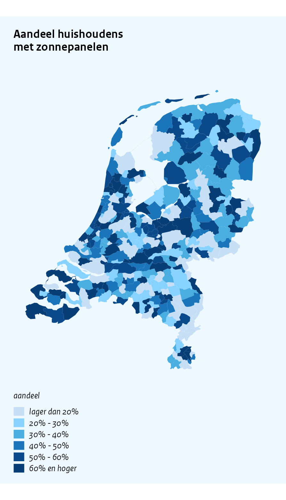

Maps
================

``` r
library(ggcpb)
library(ggplot2)
library(dplyr)
set.seed(42)
```

`cpb_map()` draws a value per Dutch municipality, COROP region or
province on bundled generalised CBS/Kadaster boundaries (2025, via
cartomap), so no geo packages or downloads are needed. Borders are
hairlines in the background colour, so regions read as tiles separated
by light-blue seams.

# Classed maps

CPB choropleths are usually *classed*: the values are binned into a
handful of ordered classes and filled with a light-to-dark ramp.
`cpb_cut()` does the binning with tidy Dutch class labels (“lager dan
20%”, “20% - 30%”, …, “60% en hoger”), and `palette = "blues"` gives the
house blue ramp. Regions are joined by CBS code (`"GM0014"`, `"CR01"`,
`"PV20"`) or by name, whichever matches the `region` column best;
regions without a value get the CPB missing-value grey, and unmatched
regions raise a warning:

``` r
gemeenten <- tibble(code = unique(cpb_nl_geo("gemeente")$code)) |>
  mutate(aandeel = runif(n(), 5, 75),
         klasse  = cpb_cut(aandeel, breaks = c(0, 20, 30, 40, 50, 60, Inf),
                           labeller = label_pct_nl()))

cpb_map(gemeenten, region = code, value = klasse,
  palette = "blues",
  title   = "Aandeel huishoudens\nmet zonnepanelen",
  filllab = "aandeel")
#> Warning in ggplot2::geom_polygon(colour = border_colour, linewidth =
#> border_linewidth, : Ignoring empty aesthetic: `colour`.
```



The map fills the half-page width (`page = "half"` in `save_cpb()`);
because the Netherlands is taller than it is wide, a map figure needs a
taller canvas than a chart – here `fig.height` is set so the map is not
squeezed. The title is broken over two lines with `"\n"`: a single-line
title that runs wider than the panel triggers a warning from
`save_cpb()`, which suggests exactly this.

`cpb_cut()` is a house-styled wrapper around `cut()`: give it the
`breaks` (including the outer bounds, `Inf` for an open top class) and a
formatter (`label_pct_nl()`, `label_euro_nl()`, `label_number_nl()`),
and it returns an ordered factor whose levels read the way published
figures label them. A single integer (`breaks = 5`) asks for that many
equal-width bins. The `"blues"` palette works in every CPB scale, not
just maps – use it for classed bars too.

# Continuous maps

For a raw numeric value, `cpb_map()` fills with the CPB sequential
gradient and a compact horizontal colourbar. As elsewhere the unit
caption goes in `subtitle`; there is no value axis, so `ylab` does not
apply here:

``` r
gemeenten_ct <- tibble(code = unique(cpb_nl_geo("gemeente")$code)) |>
  mutate(index = rnorm(n(), 100, 15))

cpb_map(gemeenten_ct, region = code, value = index,
  title    = "Voorbeeldindex per gemeente",
  subtitle = "index (Nederland = 100)")
#> Warning in ggplot2::geom_polygon(colour = border_colour, linewidth =
#> border_linewidth, : Ignoring empty aesthetic: `colour`.
```


# Provinces and COROP regions

`level` selects the boundaries – `"provincie"` and `"corop"` for the
coarser levels – and joining by *name* works too. A discrete `value`
column gets the discrete CPB palettes (pick colours with `index`):

``` r
provincies <- tibble(naam = unique(cpb_nl_geo("provincie")$name)) |>
  mutate(klasse = factor(
    sample(c("onder gemiddeld", "boven gemiddeld"), n(), replace = TRUE),
    levels = c("onder gemiddeld", "boven gemiddeld")
  ))

cpb_map(provincies, region = naam, value = klasse, level = "provincie",
  index = c(5, 6),
  title = "Groei ten opzichte van het landelijk gemiddelde")
#> Warning in ggplot2::geom_polygon(colour = border_colour, linewidth =
#> border_linewidth, : Ignoring empty aesthetic: `colour`.
```


# Styling and raw boundaries

The border seams are controlled with `border_colour` (default: the CPB
background colour – a deliberate deviation from the legacy plotter’s
outlined shapes) and `border_linewidth` (default `0.1`, the house
hairline). `reverse` flips the sequential gradient and `na_fill`
overrides the missing-value colour.

For anything the wrapper does not cover, the raw boundary tables are
available through `cpb_nl_geo(level)`: one row per polygon vertex with
the region `code` and `name`, ready for `ggplot2::geom_polygon()` (use
`part` as `group` and `ring` as `subgroup`).

``` r
head(cpb_nl_geo("provincie"), 3)
#>   code      name   part     ring      x      y
#> 1 PV20 Groningen PV20.1 PV20.1.1 269919 540356
#> 2 PV20 Groningen PV20.1 PV20.1.1 269519 541648
#> 3 PV20 Groningen PV20.1 PV20.1.1 270634 543238
```
