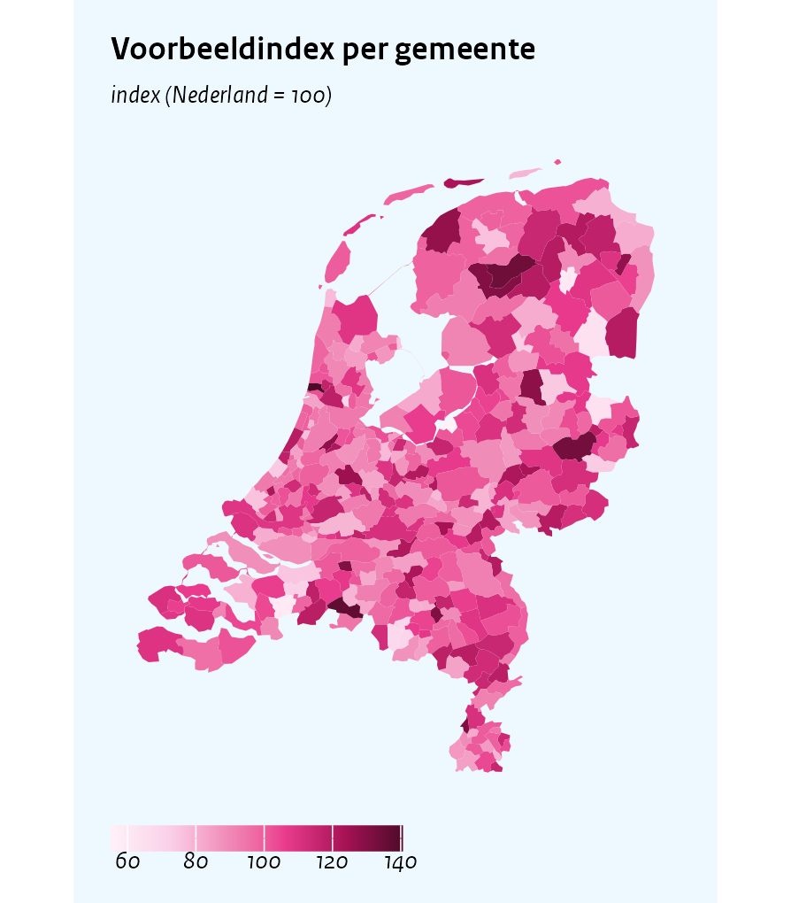
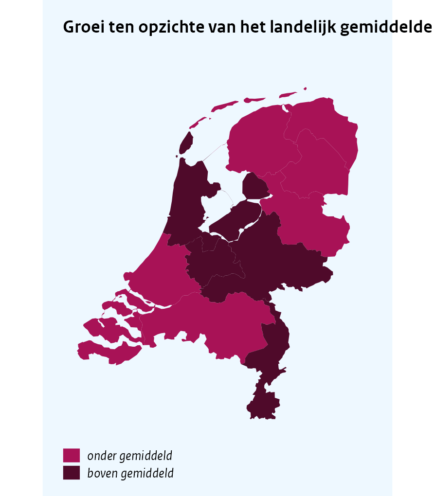

Maps
================

``` r
library(ggcpb)
library(ggplot2)
library(dplyr)
set.seed(42)
```

`cpb_map()` draws a value per Dutch municipality, COROP region or
province on bundled generalised CBS/Kadaster boundaries (2025, via
cartomap), so no geo packages or downloads are needed. Borders are
hairlines in the background colour, so regions read as tiles separated
by light-blue seams.

# Municipalities

Regions are joined by CBS code (`"GM0014"`, `"CR01"`, `"PV20"`) or by
name, whichever matches the `region` column best; regions without a
value are filled with the CPB missing-value grey, and unmatched regions
in the data raise a warning. A numeric `value` column gets the CPB
sequential gradient with a compact horizontal colourbar:

``` r
gemeenten <- tibble(code = unique(cpb_nl_geo("gemeente")$code)) |>
  mutate(index = rnorm(n(), 100, 15))

cpb_map(gemeenten, region = code, value = index,
  title    = "Voorbeeldindex per gemeente",
  subtitle = "index (Nederland = 100)")
#> Warning in ggplot2::geom_polygon(colour = border_colour, linewidth =
#> border_linewidth, : Ignoring empty aesthetic: `colour`.
```



As elsewhere, the unit caption goes in `subtitle`; there is no value
axis, so `ylab` does not exist here.

# Provinces and COROP regions

`level` selects the boundaries – `"provincie"` and `"corop"` for the
coarser levels – and joining by *name* works too. A discrete `value`
column gets the discrete CPB palettes (pick colours with `index`):

``` r
provincies <- tibble(naam = unique(cpb_nl_geo("provincie")$name)) |>
  mutate(klasse = factor(
    sample(c("onder gemiddeld", "boven gemiddeld"), n(), replace = TRUE),
    levels = c("onder gemiddeld", "boven gemiddeld")
  ))

cpb_map(provincies, region = naam, value = klasse, level = "provincie",
  index = c(5, 6),
  title = "Groei ten opzichte van het landelijk gemiddelde")
#> Warning in ggplot2::geom_polygon(colour = border_colour, linewidth =
#> border_linewidth, : Ignoring empty aesthetic: `colour`.
```



# Styling and raw boundaries

The border seams are controlled with `border_colour` (default: the CPB
background colour – a deliberate deviation from the legacy plotter’s
outlined shapes) and `border_linewidth` (default `0.1`, the house
hairline). `reverse` flips the sequential gradient and `na_fill`
overrides the missing-value colour.

For anything the wrapper does not cover, the raw boundary tables are
available through `cpb_nl_geo(level)`: one row per polygon vertex with
the region `code` and `name`, ready for `ggplot2::geom_polygon()` (use
`part` as `group` and `ring` as `subgroup`).

``` r
head(cpb_nl_geo("provincie"), 3)
#>   code      name   part     ring      x      y
#> 1 PV20 Groningen PV20.1 PV20.1.1 269919 540356
#> 2 PV20 Groningen PV20.1 PV20.1.1 269519 541648
#> 3 PV20 Groningen PV20.1 PV20.1.1 270634 543238
```
