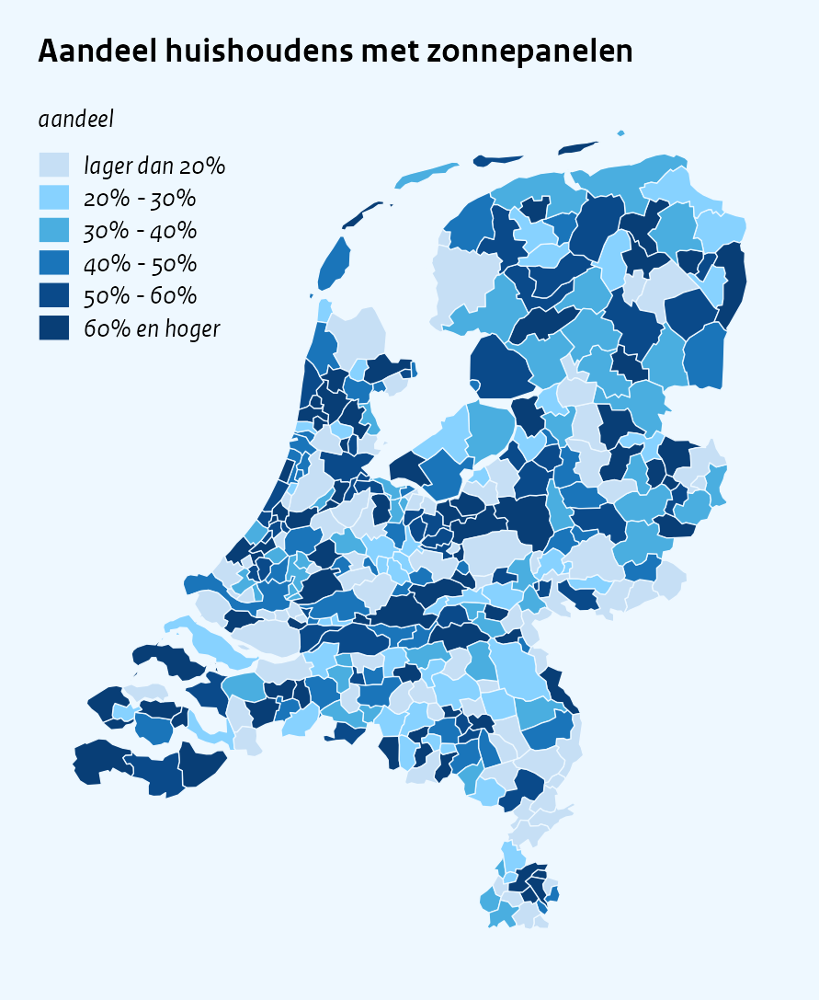
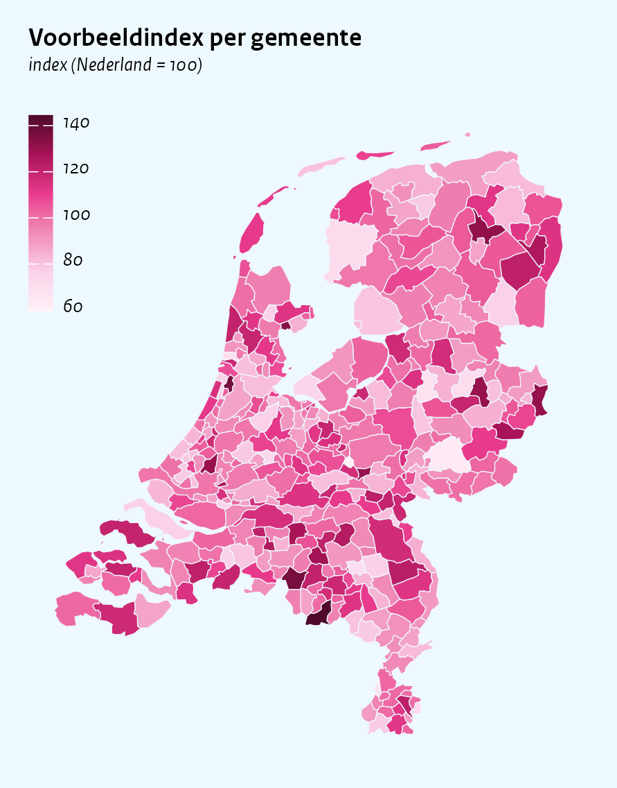
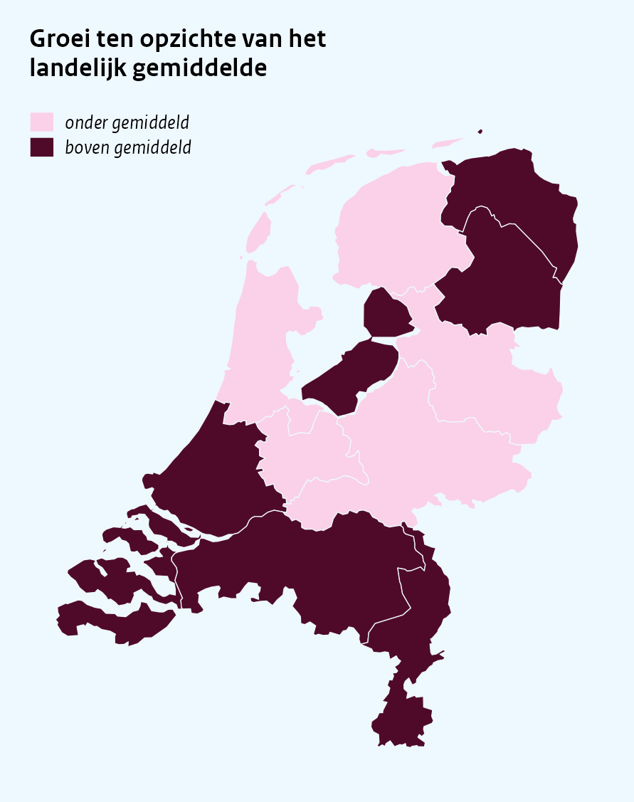

Maps
================

``` r
library(ggcpb)
library(ggplot2)
library(dplyr)
set.seed(42)
```

`cpb_map()` draws a value per Dutch municipality or province on bundled
generalised CBS/Kadaster boundaries (2025, via cartomap), so no geo
packages or downloads are needed. Regions are separated by thin
background-colour seams, and the legend sits inside the panel at
top-left – in the empty North Sea corner of the country.

A map is taller relative to its width than a chart, so `save_cpb()`
auto-fits the panel to the boundaries’ true aspect ratio, rather than
letting it sit letterboxed inside a guessed `fig.height` (see “Styling
and raw boundaries” below). Every map below is therefore written to a
file with `save_cpb()` and shown from that file, exactly as it would
look saved for a report – the code that builds and saves each map is the
code shown; only the line that displays it back inline for this page is
left out.

# Classed maps

CPB choropleths are usually *classed*: the values are binned into a
handful of ordered classes and filled with a light-to-dark ramp.
`cpb_cut()` does the binning with tidy Dutch class labels (“lager dan
20%”, “20% - 30%”, …, “60% en hoger”), and `palette = "blues"` gives the
house blue ramp. Regions are joined by CBS code (`"GM0014"`, `"PV20"`)
or by name, whichever matches the `region` column best; regions without
a value get the CPB missing-value grey, and unmatched regions raise a
warning:

``` r
gemeenten <- tibble(code = unique(cpb_nl_geo("gemeente")$code)) |>
  mutate(aandeel = runif(n(), 5, 75),
         klasse  = cpb_cut(aandeel, breaks = c(0, 20, 30, 40, 50, 60, Inf),
                           labeller = label_pct_nl()))

path <- tempfile(fileext = ".png")
save_cpb(path, cpb_map(gemeenten, region = code, value = klasse,
  palette = "blues",
  title   = "Aandeel huishoudens met zonnepanelen",
  filllab = "aandeel"), page = "half")
```



`cpb_cut()` is a house-styled wrapper around `cut()`: give it the
`breaks` (including the outer bounds, `Inf` for an open top class) and a
formatter (`label_pct_nl()`, `label_euro_nl()`, `label_number_nl()`),
and it returns an ordered factor whose levels read the way published
figures label them. A single integer (`breaks = 5`) asks for that many
equal-width bins.

# Continuous maps

For a raw numeric value, `cpb_map()` fills with the CPB sequential
gradient and a compact colourbar (vertical, top-left, alongside the
map). As elsewhere the unit caption goes in `subtitle`; there is no
value axis, so `ylab` does not apply here:

``` r
gemeenten_ct <- tibble(code = unique(cpb_nl_geo("gemeente")$code)) |>
  mutate(index = rnorm(n(), 100, 15))

path <- tempfile(fileext = ".png")
save_cpb(path, cpb_map(gemeenten_ct, region = code, value = index,
  title    = "Voorbeeldindex per gemeente",
  subtitle = "index (Nederland = 100)"), page = "half")
```



# Provinces

`level = "provincie"` draws the coarser province boundaries instead;
`"corop"` works the same way for COROP regions. A discrete `value` gets
the discrete CPB palette (pick colours with `index`); a title that runs
wider than the panel triggers a warning from `save_cpb()`, which
suggests breaking it over two lines with `"\n"`, as here:

``` r
provincies <- tibble(naam = unique(cpb_nl_geo("provincie")$name)) |>
  mutate(klasse = factor(
    sample(c("onder gemiddeld", "boven gemiddeld"), n(), replace = TRUE),
    levels = c("onder gemiddeld", "boven gemiddeld")
  ))

path <- tempfile(fileext = ".png")
save_cpb(path, cpb_map(provincies, region = naam, value = klasse, level = "provincie",
  fill_index = c(2, 6),
  title = "Groei ten opzichte van het\nlandelijk gemiddelde"), page = "half")
```



# Styling and raw boundaries

The border seams are controlled with `border_colour` (default the CPB
background colour; pass `"white"` for more contrast, e.g. on a two-class
map) and `border_linewidth` (default `0.15`). The legend defaults to
`legend = "topleft"` inside the panel; pass `legend = "bottom"` for the
flush bottom-left legend of the other wrappers, or `legend = "none"`.
`reverse` flips the sequential gradient and `na_fill` overrides the
missing-value colour.

For anything the wrapper does not cover, the raw boundary tables are
available through `cpb_nl_geo(level)`: one row per polygon vertex with
the region `code` and `name`, ready for `ggplot2::geom_polygon()` (use
`part` as `group` and `ring` as `subgroup`).

``` r
head(cpb_nl_geo("provincie"), 3)
#>   code      name   part     ring      x      y
#> 1 PV20 Groningen PV20.1 PV20.1.1 269919 540356
#> 2 PV20 Groningen PV20.1 PV20.1.1 269519 541648
#> 3 PV20 Groningen PV20.1 PV20.1.1 270634 543238
```
